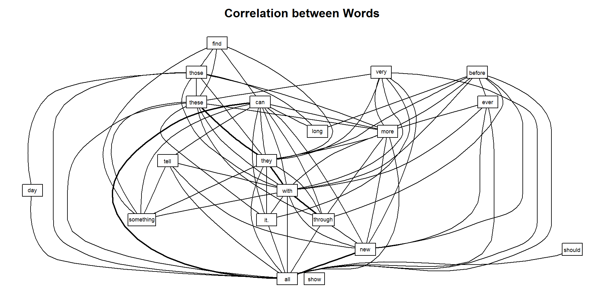
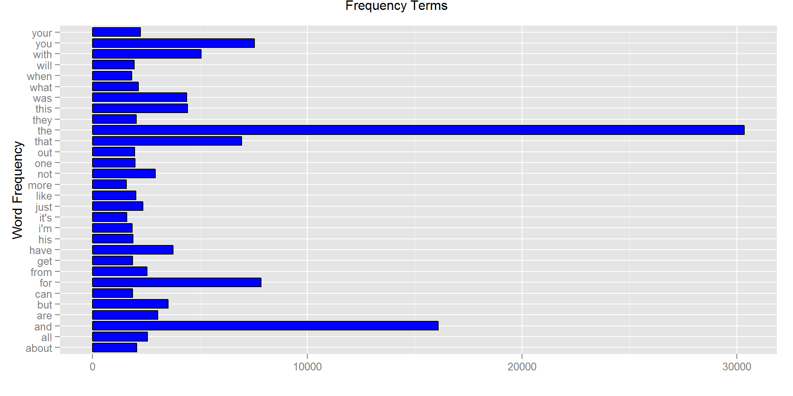

Version: V01

Date: 29-MAR-2015

GitHub Repository: https://github.com/A6111E/datasciencecoursera/tree/master/Capstone_Project/Milestone_Report

### Synopsis:
The principal steps for this project are:

- Exploratory Analysis: through a markdown report "Milestone Report - Word Prediction".

- Create a language prediction algorithm.

- Create a Shiny App as interface of the language model that can be access by others, taking as input a phrase (multiple words) in a text box input and outputs a prediction of the next word.


### Source:
For viewing the code for generating this markdown document, please refer to the  
GitHub Repository.


### Exploratory Analysis


**DataSet Description:**
Data, from a corpus called HC Corpora (http://www.corpora.heliohost.org). 

Collected from numerous different sources, for getting a varied and comprehensive corpus of current use on different languages.
 
Sources, such as newspapers, magazines, personal and professional blogs and Twitter updates.

**Dataset:** 

- Can be downloaded from: https://d396qusza40orc.cloudfront.net/dsscapstone/dataset/Coursera-SwiftKey.zip

- Each dataset compose from 3 corpus groups: blogs, news, twitter  

- Available languages:
a. **en_US:** English USA
b. **de_DE:** standard German
c. **fi_FI:** Finnish
d. **ru_RU:** Russian

**Other Languages:**

For this Beta version, the complete analysis / prediction / application will be done for English only, but easily replicable due to the programming methodology, changing only the word "en" by "de" for example.

**English Language:**

- File: en_US.blogs.txt
a. **File Size:** $MByte_blog = 248.5 Mb $
b. **Text Lines:** $Lines_blog = 899288 $ 
c. **Word Number:** $Words_blog = 37334131 $

- File: en_US.news.txt
a. **File Size:** $MByte_news = 19.2 Mb $
b. **Text Lines:** $Lines_news = 77259 $ 
c. **Word Number:** $Words_news = 2643969 $ 

- File: en_US.twitter.txt
a. **File Size:** $MByte_twitter = 301.4 Mb $
b. **Text Lines:** $Lines_twitter = 2360148 $
c. **Word Number:** $Words_twitter = 30373583 $

**Considerations:**

For a total file size of $569$ Mb, with $Total_Lines = 3336695 $ lines and  $Total_Words = 70351683$ words, the 3 working datasets will be randomly sample with the rbinom() function (random generation binomial distribution), assuming "flip a biased or unfair coin" to determine whether a line of text will be sample or not.

A fair coin, the probability of falling on either side (heads / tails) when it is tossed is approximately $50%$.

For this case (unfair coin), the probability whether a line of text on the 3 files will be sample or not, is less than $50%$. 

For an initial Exploratory Analysis, only $1%$ of the lines for each data set will be sample. Later, and during the development of the "shiny" application, this % would be increase or decreased according with the memory capacity.

- Sample Parameters:
a. Number of Observations: $1$% x lines per file (blogs, news, twitter)
b. Number of Trials: lines per file (blogs, news, twitter)
c. Probability: $0.3$

After sampling the $3$ data sets, the samples will be merged in one single data set for  further analysis.


### Emojies

Specially on the twitter data set, multiple emojis were found.  On this exploratory phase, an analysis from emojis were performed according with a list of the most common Emojis used (44 Emojis).

### Table 1: Emojies Summary
[1] "C:/Users/Usuario/Documents"
<!-- html table generated in R 3.1.3 by xtable 1.7-4 package -->
<!-- Sun Mar 29 15:04:42 2015 -->
<table border=1>
<caption align="bottom">  </caption>
<tr> <th>  </th> <th> V1 </th> <th> V2 </th>  </tr>
  <tr> <td align="right"> 1 </td> <td> Emoji </td> <td> quantity </td> </tr>
  <tr> <td align="right"> 2 </td> <td> &lt;3 </td> <td> 302 </td> </tr>
  <tr> <td align="right"> 3 </td> <td> &lt;/3 </td> <td> 1 </td> </tr>
  <tr> <td align="right"> 4 </td> <td> :) </td> <td> 1095 </td> </tr>
  <tr> <td align="right"> 5 </td> <td> (: </td> <td> 286 </td> </tr>
  <tr> <td align="right"> 6 </td> <td> C: </td> <td> 9 </td> </tr>
  <tr> <td align="right"> 7 </td> <td> c: </td> <td> 0 </td> </tr>
  <tr> <td align="right"> 8 </td> <td> :D </td> <td> 202 </td> </tr>
  <tr> <td align="right"> 9 </td> <td> :-D </td> <td> 0 </td> </tr>
  <tr> <td align="right"> 10 </td> <td> ;) </td> <td> 278 </td> </tr>
   </table>


For emoji graph refer to: http://unicodey.com/emoji-data/table.htm

### Remarks:
- On an initial Exploratory Analysis of each data sets, $92$% of the Emojis are coming from the raw en_twitter data set.

- The writing style is not the same between datasets (blogs, news, twitter) and depends on several factors like country / region, education level from the user, and the application (for example twitter, Emails, Blogs, etc).

- For twitter, due to the restriction of # of letters, normally abbreviations are used.

### SwiftKey Version 5.2.2.124 for Android Benchmark:

Source: http://swiftkey.com/en

SwiftKey is an on-screen keyboard that adapts to the way the user type.

Features: the most important features are:

- Typing Less: learns the writing style to suggest / predict what the users are going to type next. Entering a whole word with a single tap, instead of typing letter by letter. 
 
 - Learns from a user's language style to make the predictions personal.

- Typing more Accurately: auto correction based on the personal writing style, even inserting missed spaces.

- Typing Easily: switch between different keyboard layouts (over 30).

- Typing up to three Languages: at once, without changing any settings.

- Typing with Emoticons: over 800 emoticons characters and clever prediction of them.

- Can access the Twitter, Facebook, and Gmail accounts to fine-tune its prediction engine to the user's unique mode of speech / write.

- Daily delivered update with the hottest words and phrases.

- Backup and Sync across devices.

- Keyboard for Android and IOS.

- Best 2014 App.

- For Android:
a. App: $34$ mB
b. Ram Memory Usage: high processor/memory usage. On a $512$ mB Ram cellular phone, the SwiftKey App slows its performance.

What are the best Android soft keyboards?

http://www.slant.co/topics/1277/compare/~swiftkey_vs_google-keyboard_vs_fleksy

The developed Shiny-App, on its beta version will have some of these features. Other features could be added later. 


### Merged Sample Data Set Transformation

The "tm" R package was used, according with the description of the "Journal of Statistical Software" - Text Mining Infrastructure in R - from March 2008, and web benchmark. The following transformation were done:

a. Remove Numbers
b. Remove Punctuation Marks
c. Remove Stop words
d. Remove affixes from words (for example, "run", "runs", "running" all become "run")
e. Remove extra White Spaces
f. Convert to lower Case Letters
g. Remove profanity words: according with list on the following source (https://github.com/shutterstock/List-of-Dirty-Naughty-Obscene-and-Otherwise-Bad-Words/)

### Table 2: Frequency Terms Summary


<!-- html table generated in R 3.1.3 by xtable 1.7-4 package -->
<!-- Sun Mar 29 15:06:29 2015 -->
<table border=1>
<caption align="bottom"> Top Ten Terms </caption>
<tr> <th>  </th> <th> freq </th>  </tr>
  <tr> <td align="right"> the </td> <td align="right"> 30347.00 </td> </tr>
  <tr> <td align="right"> and </td> <td align="right"> 16089.00 </td> </tr>
  <tr> <td align="right"> for </td> <td align="right"> 7858.00 </td> </tr>
  <tr> <td align="right"> you </td> <td align="right"> 7548.00 </td> </tr>
  <tr> <td align="right"> that </td> <td align="right"> 6954.00 </td> </tr>
  <tr> <td align="right"> with </td> <td align="right"> 5059.00 </td> </tr>
  <tr> <td align="right"> this </td> <td align="right"> 4419.00 </td> </tr>
  <tr> <td align="right"> was </td> <td align="right"> 4380.00 </td> </tr>
  <tr> <td align="right"> have </td> <td align="right"> 3754.00 </td> </tr>
  <tr> <td align="right"> but </td> <td align="right"> 3520.00 </td> </tr>
   </table>


#### Graphic 1: Correlation & Frequency Terms
  

### Further Steps

**A1:** n-grams

a. uni and bi grams initially (according with memory capacity, n-grams could be increased).

b. The uni and bi grams will be saved as data frames for later use on the Language Prediction Model.

c. Using adding the log probabilities to minimize underflow.

Source: https://class.coursera.org/nlp/lecture (based on Markov Assumptions)

**A2:** Misspellings

a. Define a method for misspelling language corrections.  

**A3:** Language Prediction Models

a. General Prediction Algorithm: for the merged sample data set, increasing the sample percentage according with memory restrictions and processing time, loading the n-grams data frames

b. User Prediction Algorithm: the writing style, user own words and application (twitter, E-Mail, blogs, etc). This algorithm, with a defined memory capacity, where the input text from the user will append to a text file. The text file, will be used for generating the User Prediction Algorithm and with misspelling language corrections.  

**A4:** Shiny-App

a. With 1 input text box, where the user will type its input phrase.

b. With 3 output text boxes, where the first 2 output boxes, for the prediction coming from the General Prediction Algorithm, and the 3rd from the User Prediction Algorithm.


### Session Information

```
## R version 3.1.3 (2015-03-09)
## Platform: x86_64-w64-mingw32/x64 (64-bit)
## Running under: Windows 8 x64 (build 9200)
## 
## locale:
## [1] LC_COLLATE=Spanish_Colombia.1252  LC_CTYPE=Spanish_Colombia.1252   
## [3] LC_MONETARY=Spanish_Colombia.1252 LC_NUMERIC=C                     
## [5] LC_TIME=Spanish_Colombia.1252    
## 
## attached base packages:
## [1] grid      stats     graphics  grDevices utils     datasets  methods  
## [8] base     
## 
## other attached packages:
##  [1] Rgraphviz_2.10.0       graph_1.44.1           gridExtra_0.9.1       
##  [4] RWeka_0.4-24           qdap_2.2.0             RColorBrewer_1.1-2    
##  [7] qdapTools_1.1.0        qdapRegex_0.2.0        qdapDictionaries_1.0.2
## [10] ggplot2_1.0.1          tm_0.6                 NLP_0.1-6             
## [13] xtable_1.7-4           plyr_1.8.1             knitr_1.9             
## 
## loaded via a namespace (and not attached):
##  [1] assertthat_0.1      BiocGenerics_0.12.1 bitops_1.0-6       
##  [4] chron_2.3-45        codetools_0.2-11    colorspace_1.2-6   
##  [7] data.table_1.9.4    DBI_0.3.1           devtools_1.7.0     
## [10] digest_0.6.8        dplyr_0.4.1         evaluate_0.5.5     
## [13] formatR_1.0         gdata_2.13.3        gender_0.4.3       
## [16] gtable_0.1.2        gtools_3.4.1        htmltools_0.2.6    
## [19] httr_0.6.1          igraph_0.7.1        jsonlite_0.9.15    
## [22] labeling_0.3        magrittr_1.5        MASS_7.3-39        
## [25] munsell_0.4.2       openNLP_0.2-4       openNLPdata_1.5.3-1
## [28] parallel_3.1.3      plotrix_3.5-11      proto_0.3-10       
## [31] Rcpp_0.11.5         RCurl_1.95-4.5      reports_0.1.4      
## [34] reshape2_1.4.1      rJava_0.9-6         rmarkdown_0.5.1    
## [37] rstudio_0.98.1103   rstudioapi_0.2      RWekajars_3.7.12-1 
## [40] scales_0.2.4        slam_0.1-32         stats4_3.1.3       
## [43] stringr_0.6.2       tools_3.1.3         venneuler_1.1-0    
## [46] wordcloud_2.5       xlsx_0.5.7          xlsxjars_0.6.1     
## [49] XML_3.98-1.1        yaml_2.1.13
```


