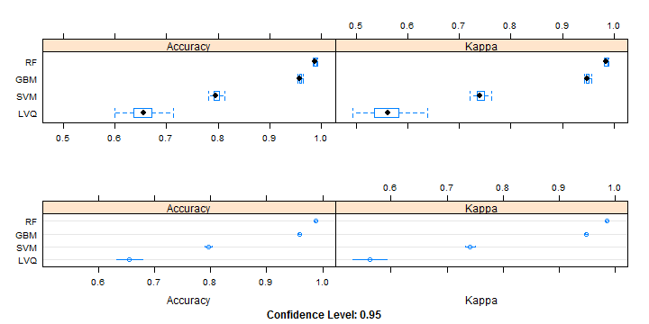

Version: V00

Date: 22-FEB-2015

GitHub Repository: https://github.com/A6111E/datasciencecoursera/tree/master/Practical_Machine_Learning

Data Source: : http://groupware.les.inf.puc-rio.br/har


#### Synopsis:
The **Human Activity Recognition Research** has been focused on discriminating between different activities like sitting, standing, walking and weight lifting, to "predict" which activity was performed at a specific point in time.

The **Weight Lifting Exercises** research, tries to investigate "how well" this activity was performed by 6 healthy male participants, aged between 20 - 28 years (adelmo, carlitos, charles, eurico, jeremy, pedro), by using a relatively light dumbbell (1.25kg).

For data recording, four 9 degrees of freedom Razor inertial measurement units (IMU), which provide three-axes acceleration, gyroscope and magnetometer data at a joint sampling rate of 45 Hz were used.

The sensors were mounted in the user's forearm, arm, lumbar belt and dumbbell and the data were recorded between November and December 2011 (11.28 to 12.05).

Pls. see on-body-sensing-schema on GitHub Repository ./graphs.

The reading for each sensor are: position (roll, pitch, yaw), acceleration (3 axis: x, y, z), gyroscope (3 axis: x, y, z) and magnetometer (3 axis: x, y, z).

The participants were asked to perform one set of 10 repetitions of the Unilateral Dumbbell Biceps Curl in five different fashions:

- Class A: exactly according with the specification.
- Class B: throwing the elbows to the front.
- Class C: lifting the dumbbell only halfway.
- Class D: lowering the dumbbell only halfway.
- Class E throwing the hips to the front.

Class A corresponds to the correct execution of the exercise, while the other 4 classes correspond to common mistakes. 

For feature extraction it was used a sliding window approach with different lengths from 0.5 second to 2.5 seconds, with 0.5 second overlap.

Read more: http://groupware.les.inf.puc-rio.br/har#ixzz3RR4j8dvi


**Source:**
View LICENSE.md on GitHub Repository


**DataSet Description:** 

- **plm-training Raw Set:** $19622$ observations - $160$ variables

- **plm-testing Raw Set:** $20$ observations - $160$ variables


### Executive Summary:

For the model selection, the following Caret's methods were used:

- **LVQ Model:** Learning Vector Quantification 
- **GBM Model:** Stochastic Gradient Boosting
- **SVM Model:** Support Vector Machines
- **RF Model:** Random Forest

Based on the **accuracy** (largest) or **error** (smallest) and **kappa**, the best model that describes the five different fashions is the **RF Model** (pls. see GitHub Repository ./data/modelRF.RData).

With the selected model, the 20 cases on the validation data set were predicted.
The answers can be found on the **Table: Assignment Answers**


### Exploratory Analysis


- On an initial exploratory analysis from the **plm-traning.csv** and **plm-testing.csv** files, there are a large number of "NA" values on both files, and according with:

a. NA Values on plm-training Set: $1925102$
b. NA Values on plm-testing Set: $2000$

- The researchers included on the data sets same columns for statistical data like kurtosis, average, maximal, minimal values, etc, calculated for each time series of sensor measurements.

- Some statistical data are missing, and it's the cause of having "NA" values.

- According with the document **2013.Velloso.QAR-WLE**, the sampling rate is $45$ Hz  ($45$ outputs per sensor per second), meaning one measurement each $0.02$ seconds.

- On the data set included for this assignment, some inaccuracies were found like: 

a. It's possible to find "new_window" with less than 45 readings.
b. For the "user_name" "carlitos" a "new_window" should start on observation $102$ and $131$.

- Due to these inaccuracies, the final training data set will be treat as independent observations and include only 48 measurements, $12$ per each of the $4$ sensors.

- After the exploratory analysis a tidy data set was generated with the following characteristics:

a. **Tidy Data Set**: $19622$ observations - $49$ variables (pls. see GitHub Repository ./data)
b. **Variable Description:** pls. see CodeBook.md on GitHub Repository


### Training - Testing Data Set

For modelling, a partition ($60/40$%) from the tidy_dataset was done (pls. see GitHub Repository ./data).

- **Training Data Set:** $11776$ observations - $49$ variables ($60$%)
- **Testing Data Set:** $7846$ observations - $49$ variables ($40$%)


### Model

For the model selection, the following Caret's methods were used, trying to combine regression - classification (dual use), for finding the best possible model:

- **LVQ Model:**        
a. Learning Vector Quantification 
b. Use: Classification
c. Tunning Parameters: size, k
                        
- **GBM Model:**        
a. Stochastic Gradient Boosting
b. Use: Dual (Regression - Classification)
c. Tunning Parameters: n.trees, interaction.depth, shrinkage

- **SVM Model:**        
a. Support Vector Machines
b. Dual Use (Regression - Classification)
c. Tunning Parameters: sigma, C

- **RF Model:**         
a. Random Forest
b. Dual Use (Regression - Classification)
c. Tunning Parameters: mtry

Remarks: due to that the outcome variable "classe" is a factor, the model should be "Classification" or "Dual Use".


Based on the **accuracy** (largest value) and **kappa** (according with the following list) of each of the models, the best model will be selected.


**Kappa:**

- $< 0$: less than chance agreement
- $0.01-0.20$: slight agreement
- $0.21- 0.40$: fair agreement
- $0.41-0.60$: moderate agreement
- $0.61-0.80$: substantial agreement
- $0.81-0.99$: almost perfect agreement


**Train Control Variables:** (Caret Package)

- Resampling Method: "repeatcv"

- Cross Validation: K-Fold (2 separate 5-fold cross validations)

- Preprocess: center, scale.


#### Table 1: Model Summary - Accuracy / Kappa per Sample
<!-- html table generated in R 3.1.2 by xtable 1.7-4 package -->
<!-- Sat Feb 21 11:29:13 2015 -->
<table border=1>
<caption align="bottom"> Model Summary </caption>
<tr> <th>  </th> <th> Resample </th> <th> LVQ~Accuracy </th> <th> LVQ~Kappa </th> <th> GBM~Accuracy </th> <th> GBM~Kappa </th> <th> SVM~Accuracy </th> <th> SVM~Kappa </th> <th> RF~Accuracy </th> <th> RF~Kappa </th>  </tr>
  <tr> <td align="right"> 1 </td> <td> Fold1.Rep1 </td> <td align="right"> 0.7137 </td> <td align="right"> 0.6378 </td> <td align="right"> 0.9601 </td> <td align="right"> 0.9495 </td> <td align="right"> 0.8025 </td> <td align="right"> 0.7486 </td> <td align="right"> 0.9851 </td> <td align="right"> 0.9812 </td> </tr>
  <tr> <td align="right"> 2 </td> <td> Fold1.Rep2 </td> <td align="right"> 0.6960 </td> <td align="right"> 0.6151 </td> <td align="right"> 0.9652 </td> <td align="right"> 0.9559 </td> <td align="right"> 0.8072 </td> <td align="right"> 0.7549 </td> <td align="right"> 0.9911 </td> <td align="right"> 0.9887 </td> </tr>
  <tr> <td align="right"> 3 </td> <td> Fold2.Rep1 </td> <td align="right"> 0.6586 </td> <td align="right"> 0.5669 </td> <td align="right"> 0.9541 </td> <td align="right"> 0.9419 </td> <td align="right"> 0.8132 </td> <td align="right"> 0.7624 </td> <td align="right"> 0.9911 </td> <td align="right"> 0.9887 </td> </tr>
  <tr> <td align="right"> 4 </td> <td> Fold2.Rep2 </td> <td align="right"> 0.6002 </td> <td align="right"> 0.4944 </td> <td align="right"> 0.9567 </td> <td align="right"> 0.9452 </td> <td align="right"> 0.7886 </td> <td align="right"> 0.7310 </td> <td align="right"> 0.9851 </td> <td align="right"> 0.9812 </td> </tr>
  <tr> <td align="right"> 5 </td> <td> Fold3.Rep1 </td> <td align="right"> 0.6617 </td> <td align="right"> 0.5702 </td> <td align="right"> 0.9576 </td> <td align="right"> 0.9463 </td> <td align="right"> 0.7950 </td> <td align="right"> 0.7394 </td> <td align="right"> 0.9898 </td> <td align="right"> 0.9871 </td> </tr>
  <tr> <td align="right"> 6 </td> <td> Fold3.Rep2 </td> <td align="right"> 0.6297 </td> <td align="right"> 0.5291 </td> <td align="right"> 0.9580 </td> <td align="right"> 0.9469 </td> <td align="right"> 0.7911 </td> <td align="right"> 0.7342 </td> <td align="right"> 0.9847 </td> <td align="right"> 0.9807 </td> </tr>
  <tr> <td align="right"> 7 </td> <td> Fold4.Rep1 </td> <td align="right"> 0.6718 </td> <td align="right"> 0.5832 </td> <td align="right"> 0.9593 </td> <td align="right"> 0.9485 </td> <td align="right"> 0.7996 </td> <td align="right"> 0.7447 </td> <td align="right"> 0.9877 </td> <td align="right"> 0.9844 </td> </tr>
  <tr> <td align="right"> 8 </td> <td> Fold4.Rep2 </td> <td align="right"> 0.6382 </td> <td align="right"> 0.5361 </td> <td align="right"> 0.9580 </td> <td align="right"> 0.9468 </td> <td align="right"> 0.7941 </td> <td align="right"> 0.7380 </td> <td align="right"> 0.9890 </td> <td align="right"> 0.9860 </td> </tr>
  <tr> <td align="right"> 9 </td> <td> Fold5.Rep1 </td> <td align="right"> 0.6511 </td> <td align="right"> 0.5558 </td> <td align="right"> 0.9639 </td> <td align="right"> 0.9544 </td> <td align="right"> 0.7810 </td> <td align="right"> 0.7211 </td> <td align="right"> 0.9864 </td> <td align="right"> 0.9828 </td> </tr>
  <tr> <td align="right"> 10 </td> <td> Fold5.Rep2 </td> <td align="right"> 0.6357 </td> <td align="right"> 0.5401 </td> <td align="right"> 0.9618 </td> <td align="right"> 0.9516 </td> <td align="right"> 0.7949 </td> <td align="right"> 0.7389 </td> <td align="right"> 0.9919 </td> <td align="right"> 0.9898 </td> </tr>
   </table>


#### Graphic 1: Model Results 
 


#### Confusion Matrix - Statistics Training - Testing Data Sets


<!-- html table generated in R 3.1.2 by xtable 1.7-4 package -->
<!-- Sat Feb 21 11:29:18 2015 -->
<table border=1>
<caption align="bottom"> Training Data Set </caption>
<tr> <th>  </th> <th> A </th> <th> B </th> <th> C </th> <th> D </th> <th> E </th> <th> class.error </th>  </tr>
  <tr> <td align="right"> A </td> <td align="right"> 3343 </td> <td align="right"> 3 </td> <td align="right"> 1 </td> <td align="right"> 0 </td> <td align="right"> 1 </td> <td align="right"> 0.0015 </td> </tr>
  <tr> <td align="right"> B </td> <td align="right"> 15 </td> <td align="right"> 2254 </td> <td align="right"> 10 </td> <td align="right"> 0 </td> <td align="right"> 0 </td> <td align="right"> 0.0110 </td> </tr>
  <tr> <td align="right"> C </td> <td align="right"> 0 </td> <td align="right"> 16 </td> <td align="right"> 2034 </td> <td align="right"> 4 </td> <td align="right"> 0 </td> <td align="right"> 0.0097 </td> </tr>
  <tr> <td align="right"> D </td> <td align="right"> 0 </td> <td align="right"> 0 </td> <td align="right"> 43 </td> <td align="right"> 1884 </td> <td align="right"> 3 </td> <td align="right"> 0.0238 </td> </tr>
  <tr> <td align="right"> E </td> <td align="right"> 0 </td> <td align="right"> 0 </td> <td align="right"> 1 </td> <td align="right"> 7 </td> <td align="right"> 2157 </td> <td align="right"> 0.0037 </td> </tr>
   </table>
<!-- html table generated in R 3.1.2 by xtable 1.7-4 package -->
<!-- Sat Feb 21 11:29:18 2015 -->
<table border=1>
<caption align="bottom"> Testing Data Set </caption>
<tr> <th>  </th> <th> A </th> <th> B </th> <th> C </th> <th> D </th> <th> E </th>  </tr>
  <tr> <td align="right"> A </td> <td align="right"> 2230 </td> <td align="right"> 11 </td> <td align="right"> 0 </td> <td align="right"> 0 </td> <td align="right"> 0 </td> </tr>
  <tr> <td align="right"> B </td> <td align="right"> 2 </td> <td align="right"> 1503 </td> <td align="right"> 5 </td> <td align="right"> 0 </td> <td align="right"> 0 </td> </tr>
  <tr> <td align="right"> C </td> <td align="right"> 0 </td> <td align="right"> 4 </td> <td align="right"> 1363 </td> <td align="right"> 21 </td> <td align="right"> 3 </td> </tr>
  <tr> <td align="right"> D </td> <td align="right"> 0 </td> <td align="right"> 0 </td> <td align="right"> 0 </td> <td align="right"> 1262 </td> <td align="right"> 4 </td> </tr>
  <tr> <td align="right"> E </td> <td align="right"> 0 </td> <td align="right"> 0 </td> <td align="right"> 0 </td> <td align="right"> 3 </td> <td align="right"> 1435 </td> </tr>
   </table>


##### Training Data Set:
- Best Model:                   Random Forest - Classification (pls. see ./data/modelRf.RData on GitHub Repository)
- Maximal Accuracy:             $0.9882$
- Maximal Kappa:                $0.9851$
- mtry:                         $2$

##### Testing Data Set:
- Accuracy:                     $0.9932$
- Kappa:                        $0.9915$
- Confidence Interval (95%):    $0.9912, 0.9949$
- p_value:                      $0e+00$

##### In Sample - Training / Out Sample Error - Testing
In Random Forests, there is no need for cross-validation or a separate test set to get an unbiased estimate of the test set error (OOB), although:

Estimated Error: 

- In Sample - Training Data Set: $0.8832$% (less than 1%)

- Out Sample - Testing Data Set: $0.6755$% (less than 1%)

The out sample error is smaller than the in sample error and according with: 
$0.6755$% $<$ $0.8832%$


A perfect predictor would be described as 100% sensitive and 100% specificity.

- Sensitivity (True Positive Rate): measures the proportion of actual positives which are correctly identified.

- Specificity (True Negative Rate): measures the proportion of negatives which are correctly identified.


For our predictor model (sensitivity / specificity):

- **Classe A:**                   $0.9991, 0.998$
- **Classe B:**                   $0.9901, 0.9989$
- **Classe C:**                   $0.9963, 0.9957$
- **Classe D:**                   $0.9813, 0.9994$
- **Classe E:**                   $0.9951, 0.9994$

Comparing the accuracy for the training data set (in sample) and the testing data set (out sample), it is almost $0.9882$ / $0.9932$ with a $95$% confidence interval from $0.9912, 0.9949$.

## Validation Data Set:


<!-- html table generated in R 3.1.2 by xtable 1.7-4 package -->
<!-- Sat Feb 21 11:29:19 2015 -->
<table border=1>
<tr> <th>  </th> <th> problem_id </th> <th> predicted_classe </th> <th> roll_belt </th> <th> pitch_belt </th> <th> yaw_belt </th> <th> gyros_belt_x </th> <th> gyros_belt_y </th> <th> gyros_belt_z </th> <th> accel_belt_x </th> <th> accel_belt_y </th> <th> accel_belt_z </th>  </tr>
  <tr> <td align="right"> 1 </td> <td align="right">   1 </td> <td> B </td> <td align="right"> 123.00 </td> <td align="right"> 27.00 </td> <td align="right"> -4.75 </td> <td align="right"> -0.50 </td> <td align="right"> -0.02 </td> <td align="right"> -0.46 </td> <td align="right"> -38 </td> <td align="right">  69 </td> <td align="right"> -179 </td> </tr>
  <tr> <td align="right"> 2 </td> <td align="right">   2 </td> <td> A </td> <td align="right"> 1.02 </td> <td align="right"> 4.87 </td> <td align="right"> -88.90 </td> <td align="right"> -0.06 </td> <td align="right"> -0.02 </td> <td align="right"> -0.07 </td> <td align="right"> -13 </td> <td align="right">  11 </td> <td align="right">  39 </td> </tr>
  <tr> <td align="right"> 3 </td> <td align="right">   3 </td> <td> B </td> <td align="right"> 0.87 </td> <td align="right"> 1.82 </td> <td align="right"> -88.50 </td> <td align="right"> 0.05 </td> <td align="right"> 0.02 </td> <td align="right"> 0.03 </td> <td align="right">   1 </td> <td align="right">  -1 </td> <td align="right">  49 </td> </tr>
  <tr> <td align="right"> 4 </td> <td align="right">   4 </td> <td> A </td> <td align="right"> 125.00 </td> <td align="right"> -41.60 </td> <td align="right"> 162.00 </td> <td align="right"> 0.11 </td> <td align="right"> 0.11 </td> <td align="right"> -0.16 </td> <td align="right">  46 </td> <td align="right">  45 </td> <td align="right"> -156 </td> </tr>
  <tr> <td align="right"> 5 </td> <td align="right">   5 </td> <td> A </td> <td align="right"> 1.35 </td> <td align="right"> 3.33 </td> <td align="right"> -88.60 </td> <td align="right"> 0.03 </td> <td align="right"> 0.02 </td> <td align="right"> 0.00 </td> <td align="right">  -8 </td> <td align="right">   4 </td> <td align="right">  27 </td> </tr>
  <tr> <td align="right"> 6 </td> <td align="right">   6 </td> <td> E </td> <td align="right"> -5.92 </td> <td align="right"> 1.59 </td> <td align="right"> -87.70 </td> <td align="right"> 0.10 </td> <td align="right"> 0.05 </td> <td align="right"> -0.13 </td> <td align="right"> -11 </td> <td align="right"> -16 </td> <td align="right">  38 </td> </tr>
  <tr> <td align="right"> 7 </td> <td align="right">   7 </td> <td> D </td> <td align="right"> 1.20 </td> <td align="right"> 4.44 </td> <td align="right"> -87.30 </td> <td align="right"> -0.06 </td> <td align="right"> 0.00 </td> <td align="right"> 0.00 </td> <td align="right"> -14 </td> <td align="right">   2 </td> <td align="right">  35 </td> </tr>
  <tr> <td align="right"> 8 </td> <td align="right">   8 </td> <td> B </td> <td align="right"> 0.43 </td> <td align="right"> 4.15 </td> <td align="right"> -88.50 </td> <td align="right"> -0.18 </td> <td align="right"> -0.02 </td> <td align="right"> -0.03 </td> <td align="right"> -10 </td> <td align="right">  -2 </td> <td align="right">  42 </td> </tr>
  <tr> <td align="right"> 9 </td> <td align="right">   9 </td> <td> A </td> <td align="right"> 0.93 </td> <td align="right"> 6.72 </td> <td align="right"> -93.70 </td> <td align="right"> 0.10 </td> <td align="right"> 0.00 </td> <td align="right"> -0.02 </td> <td align="right"> -15 </td> <td align="right">   1 </td> <td align="right">  32 </td> </tr>
  <tr> <td align="right"> 10 </td> <td align="right">  10 </td> <td> A </td> <td align="right"> 114.00 </td> <td align="right"> 22.40 </td> <td align="right"> -13.10 </td> <td align="right"> 0.14 </td> <td align="right"> 0.11 </td> <td align="right"> -0.16 </td> <td align="right"> -25 </td> <td align="right">  63 </td> <td align="right"> -158 </td> </tr>
  <tr> <td align="right"> 11 </td> <td align="right">  11 </td> <td> B </td> <td align="right"> 0.92 </td> <td align="right"> 5.94 </td> <td align="right"> -92.70 </td> <td align="right"> 0.05 </td> <td align="right"> 0.00 </td> <td align="right"> 0.00 </td> <td align="right"> -18 </td> <td align="right">   4 </td> <td align="right">  27 </td> </tr>
  <tr> <td align="right"> 12 </td> <td align="right">  12 </td> <td> C </td> <td align="right"> 1.01 </td> <td align="right"> 4.96 </td> <td align="right"> -87.80 </td> <td align="right"> -0.10 </td> <td align="right"> 0.00 </td> <td align="right"> 0.02 </td> <td align="right"> -22 </td> <td align="right">   8 </td> <td align="right">  40 </td> </tr>
  <tr> <td align="right"> 13 </td> <td align="right">  13 </td> <td> B </td> <td align="right"> 0.54 </td> <td align="right"> 2.45 </td> <td align="right"> -88.60 </td> <td align="right"> -0.06 </td> <td align="right"> 0.00 </td> <td align="right"> -0.13 </td> <td align="right">  -8 </td> <td align="right">   5 </td> <td align="right">  24 </td> </tr>
  <tr> <td align="right"> 14 </td> <td align="right">  14 </td> <td> A </td> <td align="right"> 0.45 </td> <td align="right"> 5.02 </td> <td align="right"> -87.90 </td> <td align="right"> -0.05 </td> <td align="right"> 0.00 </td> <td align="right"> 0.00 </td> <td align="right"> -14 </td> <td align="right">   2 </td> <td align="right">  49 </td> </tr>
  <tr> <td align="right"> 15 </td> <td align="right">  15 </td> <td> E </td> <td align="right"> 5.34 </td> <td align="right"> -3.09 </td> <td align="right"> -80.30 </td> <td align="right"> 0.24 </td> <td align="right"> 0.00 </td> <td align="right"> 0.05 </td> <td align="right">   8 </td> <td align="right">  19 </td> <td align="right">  28 </td> </tr>
  <tr> <td align="right"> 16 </td> <td align="right">  16 </td> <td> E </td> <td align="right"> 1.65 </td> <td align="right"> 3.47 </td> <td align="right"> -87.00 </td> <td align="right"> 0.02 </td> <td align="right"> 0.02 </td> <td align="right"> 0.00 </td> <td align="right"> -12 </td> <td align="right">   5 </td> <td align="right">  20 </td> </tr>
  <tr> <td align="right"> 17 </td> <td align="right">  17 </td> <td> A </td> <td align="right"> 129.00 </td> <td align="right"> 27.80 </td> <td align="right"> 1.84 </td> <td align="right"> -0.50 </td> <td align="right"> 0.00 </td> <td align="right"> -0.48 </td> <td align="right"> -47 </td> <td align="right">  69 </td> <td align="right"> -187 </td> </tr>
  <tr> <td align="right"> 18 </td> <td align="right">  18 </td> <td> B </td> <td align="right"> 0.92 </td> <td align="right"> 5.31 </td> <td align="right"> -93.10 </td> <td align="right"> 0.02 </td> <td align="right"> 0.00 </td> <td align="right"> -0.05 </td> <td align="right"> -13 </td> <td align="right">   3 </td> <td align="right">  24 </td> </tr>
  <tr> <td align="right"> 19 </td> <td align="right">  19 </td> <td> B </td> <td align="right"> 123.00 </td> <td align="right"> 26.70 </td> <td align="right"> -2.68 </td> <td align="right"> -0.31 </td> <td align="right"> -0.05 </td> <td align="right"> -0.44 </td> <td align="right"> -48 </td> <td align="right">  72 </td> <td align="right"> -169 </td> </tr>
  <tr> <td align="right"> 20 </td> <td align="right">  20 </td> <td> B </td> <td align="right"> 1.40 </td> <td align="right"> 3.20 </td> <td align="right"> -88.70 </td> <td align="right"> 0.06 </td> <td align="right"> -0.02 </td> <td align="right"> 0.02 </td> <td align="right">  -9 </td> <td align="right">   4 </td> <td align="right">  23 </td> </tr>
   </table>


### Session Information

```
## R version 3.1.2 (2014-10-31)
## Platform: x86_64-w64-mingw32/x64 (64-bit)
## 
## locale:
## [1] LC_COLLATE=Spanish_Colombia.1252  LC_CTYPE=Spanish_Colombia.1252   
## [3] LC_MONETARY=Spanish_Colombia.1252 LC_NUMERIC=C                     
## [5] LC_TIME=Spanish_Colombia.1252    
## 
## attached base packages:
##  [1] parallel  splines   grid      stats     graphics  grDevices utils    
##  [8] datasets  methods   base     
## 
## other attached packages:
##  [1] kernlab_0.9-20      gbm_2.1             survival_2.37-7    
##  [4] class_7.3-11        randomForest_4.6-10 gtools_3.4.1       
##  [7] plyr_1.8.1          gridExtra_0.9.1     knitr_1.8          
## [10] xtable_1.7-4        data.table_1.9.4    caret_6.0-41       
## [13] ggplot2_1.0.0       lattice_0.20-29    
## 
## loaded via a namespace (and not attached):
##  [1] BradleyTerry2_1.0-5 brglm_0.5-9         car_2.0-22         
##  [4] chron_2.3-45        codetools_0.2-9     colorspace_1.2-4   
##  [7] digest_0.6.4        e1071_1.6-4         evaluate_0.5.5     
## [10] foreach_1.4.2       formatR_1.0         gtable_0.1.2       
## [13] htmltools_0.2.6     iterators_1.0.7     lme4_1.1-7         
## [16] MASS_7.3-35         Matrix_1.1-4        minqa_1.2.4        
## [19] munsell_0.4.2       nlme_3.1-118        nloptr_1.0.4       
## [22] nnet_7.3-8          proto_0.3-10        Rcpp_0.11.3        
## [25] reshape2_1.4        rmarkdown_0.3.3     scales_0.2.4       
## [28] stringr_0.6.2       tools_3.1.2         yaml_2.1.13
```


