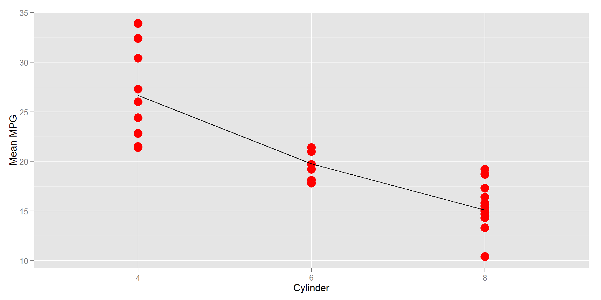
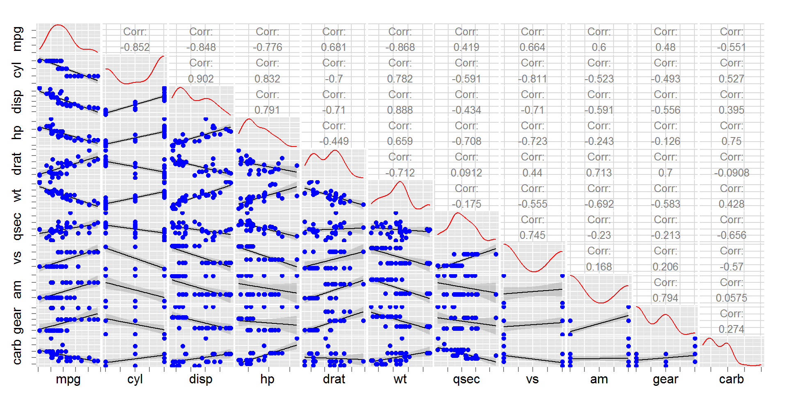
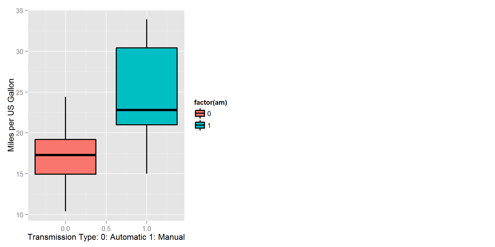
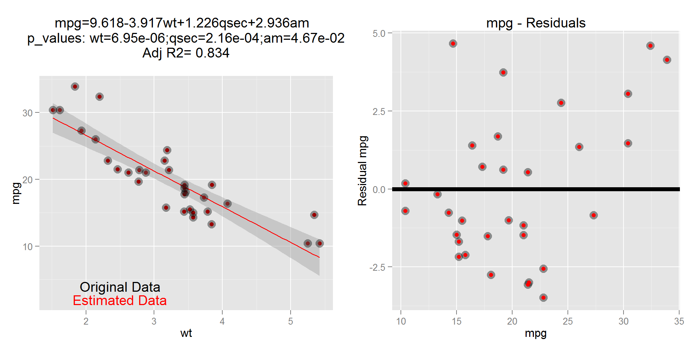
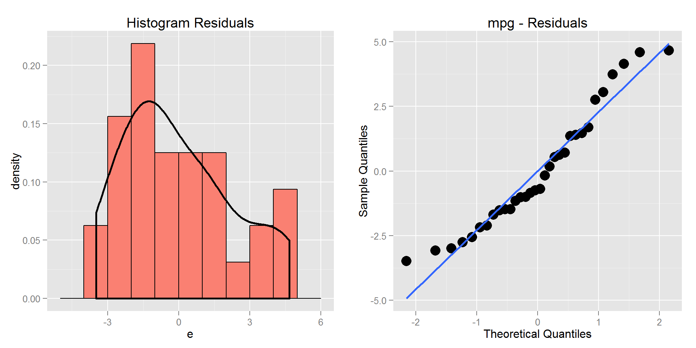

Version: V00

Date: 25-JAN-2015

GitHub Repository: https://github.com/A6111E/datasciencecoursera/tree/master/Regression_Models

Data Source: R Data Set Package "data sets" - Data: "mtcars"

#### Synopsis:
In the attempt to predict gasoline mileage for 1973 - 1974 automobiles, road tests were preformed by Motor Trend US Magazine, in which gas mileage and 10 physical characteristics of various types of automobiles were recorded.

**Source:**
Biometrics Invited Paper: The Analysis and Selection of Variables in Linear Regression
by R. R. Hocking
Biometrics - Vol. 32, No. 1 (Mar., 1976), pp. 

**DataSet Description:** Extracted from Motor Trend US Magazine in 1.974 and comprises fuel  consumption, 10 different aspects of automobile design and performance for 32 automobiles (1973-74 models).

**- Data Frame:** $32$ observations - $11$ variables

**- Variable [mpg]:** numeric - mpg (miles per US gallon)

**- Variable [cyl]:** numeric - Number of Cylinders

**- Variable [disp]:** numeric - Cylinder Displacement (cu.in)

**- Variable [hp]:** numeric - Gross Horsepower (hp)

**- Variable [drat]:** numeric - Rear Axle ratio 

**- Variable [wt]:** numeric - Weight (lb/1000)

**- Variable [qsec]:** numeric - 1/4 Mile Time (sec)

**- Variable [vs]:** numeric - Cylinder Configuration (V - S: straight ) (0 = V, 1 = S)

**- Variable [am]:** numeric - Transmission (0 = automatic, 1 = manual)

**- Variable [gear]:** numeric - Number of forward Gears

**- Variable [carb]:** numeric - Number of Carburetors

With this data set, this research tries to answer:

1. Is an automatic or manual transmission better for MPG (gas mileage)?

2. Quantify the MPG (gas mileage) difference between automatic and manual transmissions

### Executive Summary:

- After a Exploratory Analysis and Model Finding, the best linear model, that predict the gasoline mileage for this data set is:

$$mpg = 9.62 - 3.92wt + 1.23qsec + 2.94am$$

- An Adjusted $R^2 = 0.83$, indicates that **$83.36%$** of the variance in the outcome variable $mpg$ can be explained by the predictors variables $wt, qsec, am$ and this linear model.

- The **Manual Transmission** is more efficient than the **Automatic Tranmission** in $2.94 miles/gal$

### Exploratory Analysis:


#### Table 1: Data Preview 
<!-- html table generated in R 3.1.2 by xtable 1.7-4 package -->
<!-- Sun Jan 25 08:02:59 2015 -->
<table border=1>
<tr> <th>  </th> <th> mpg </th> <th> cyl </th> <th> disp </th> <th> hp </th> <th> drat </th> <th> wt </th> <th> qsec </th> <th> vs </th> <th> am </th> <th> gear </th> <th> carb </th>  </tr>
  <tr> <td align="right"> 1 </td> <td align="right"> 21.00 </td> <td align="right"> 6.00 </td> <td align="right"> 160.00 </td> <td align="right"> 110.00 </td> <td align="right"> 3.90 </td> <td align="right"> 2.62 </td> <td align="right"> 16.46 </td> <td align="right"> 0.00 </td> <td align="right"> 1.00 </td> <td align="right"> 4.00 </td> <td align="right"> 4.00 </td> </tr>
  <tr> <td align="right"> 2 </td> <td align="right"> 21.00 </td> <td align="right"> 6.00 </td> <td align="right"> 160.00 </td> <td align="right"> 110.00 </td> <td align="right"> 3.90 </td> <td align="right"> 2.88 </td> <td align="right"> 17.02 </td> <td align="right"> 0.00 </td> <td align="right"> 1.00 </td> <td align="right"> 4.00 </td> <td align="right"> 4.00 </td> </tr>
  <tr> <td align="right"> 3 </td> <td align="right"> 22.80 </td> <td align="right"> 4.00 </td> <td align="right"> 108.00 </td> <td align="right"> 93.00 </td> <td align="right"> 3.85 </td> <td align="right"> 2.32 </td> <td align="right"> 18.61 </td> <td align="right"> 1.00 </td> <td align="right"> 1.00 </td> <td align="right"> 4.00 </td> <td align="right"> 1.00 </td> </tr>
  <tr> <td align="right"> 4 </td> <td align="right"> 21.40 </td> <td align="right"> 6.00 </td> <td align="right"> 258.00 </td> <td align="right"> 110.00 </td> <td align="right"> 3.08 </td> <td align="right"> 3.21 </td> <td align="right"> 19.44 </td> <td align="right"> 1.00 </td> <td align="right"> 0.00 </td> <td align="right"> 3.00 </td> <td align="right"> 1.00 </td> </tr>
  <tr> <td align="right"> 5 </td> <td align="right"> 18.70 </td> <td align="right"> 8.00 </td> <td align="right"> 360.00 </td> <td align="right"> 175.00 </td> <td align="right"> 3.15 </td> <td align="right"> 3.44 </td> <td align="right"> 17.02 </td> <td align="right"> 0.00 </td> <td align="right"> 0.00 </td> <td align="right"> 3.00 </td> <td align="right"> 2.00 </td> </tr>
  <tr> <td align="right"> 6 </td> <td align="right"> 18.10 </td> <td align="right"> 6.00 </td> <td align="right"> 225.00 </td> <td align="right"> 105.00 </td> <td align="right"> 2.76 </td> <td align="right"> 3.46 </td> <td align="right"> 20.22 </td> <td align="right"> 1.00 </td> <td align="right"> 0.00 </td> <td align="right"> 3.00 </td> <td align="right"> 1.00 </td> </tr>
   </table>


 


<environment: R_GlobalEnv>


- The value of cylinder is a categorical variable

- Half of the cars get 19.20 miles per gallon or less (Median). 

- The variability or spread for $mpg$ is equal to $\sigma = 6.02$

- For the multivariate $mpg$ data, there should be some relationship with the size of the engine (# of cylinders, gross horsepower or even the cylinder displacement). 

- Plotting $mpg$ ~ $cyl$, a decreasing trend on $mpg$ as the # of $cyl$ increases is obvious, and it should be a candidate fit a regression line.

- The summary on table "Table A1: Statistical Data Summary - Mileage per US Gallon " included on the Appendix, shows statistical data like the mean, standard deviation, variance, median, maximal and minimal values, for each type of transmission (Automatic - Manual) in relationship with the Mileage per US Gallon (mpg).

- According with this table, the maximal and minimal values for **Manual Transmission**, are higher than corresponding values for **Automatic Transmission**, although its standard deviation is greater.

- Taking "Mileage per US Gallon (mpg)" as outcome, and using the other variables as predictors, statistical coefficients will be calculated for a linear model during a  exploratory analysis.

- This can be observed on Graphic A1 included on the Appendix.

**Initial Conclusions:**

- **Manual Transmission**: higher throughput for the outcome "Mileage per US Gallon (mpg)" in compassion with the **Automatic Transmission**.

- **Transmision Type (am)**: according with the Statistic Coefficients Table and related graphic (please see the Appendix), the **am** variable is the **7th** place of influence on the **mpg**  variable.

- According with the correlation (please see Appendix - Table A2) for the required outcome $mpg$ and the predictors, the impact on it in descending order is: $1. wt, 2. cyl, 3. disp, 4. hp, 5. drat, 6. vs, 7. am, 8. carb, 9. gear, 10. qsec$

- The variable $qsec$ is the required time for driving $/1/4$ of mile. From physics  in general, less time means more acceleration and final speed and more gas consumption. Although this variable has the smallest correlation with $mpg$, it can not be avoided from the model analysis.  

- The model with $mpg$ as outcome, should **NOT** have **ONLY** one predictor.

- The number of possible combinations for this linear model is $1023$.

- Due to the high number of possible combinations, it's necessary to use an algorithm (Stepwise Algorithm, where the best model corresponds to the smallest AIC).

### Statistical Inference

**Hypothesis 1**:

- Null hypothesis $H_{01}$: is that the residuals of the calculated linear model are normally distribute and do not have trends.

- Alternative Hypothesis $H_{a1}$: opposite as the null hypothesis.

**Hypothesis 2**:

- Null hypothesis $H_{02}$: is that the base model $mpg$ ~ $am$ (trying to answer the  main questions), is less representative that the best model ($mpg$ as outcome and several variables as predictors).

- Alternative Hypothesis $H_{a2}$: opposite as the null hypothesis.

### Modeling

- Including all variables in an initial linear model, all p-value´s are not less than 0.05, and a linear model including all variables **is not** representative.     

#### Table 2: Summary Linear Model - All Variables
<!-- html table generated in R 3.1.2 by xtable 1.7-4 package -->
<!-- Sun Jan 25 08:03:02 2015 -->
<table border=1>
<tr> <th>  </th> <th> Estimate </th> <th> Std. Error </th> <th> t value </th> <th> Pr(&gt;|t|) </th>  </tr>
  <tr> <td align="right"> (Intercept) </td> <td align="right"> 12.30 </td> <td align="right"> 18.72 </td> <td align="right"> 0.66 </td> <td align="right"> 0.52 </td> </tr>
  <tr> <td align="right"> cyl </td> <td align="right"> -0.11 </td> <td align="right"> 1.05 </td> <td align="right"> -0.11 </td> <td align="right"> 0.92 </td> </tr>
  <tr> <td align="right"> disp </td> <td align="right"> 0.01 </td> <td align="right"> 0.02 </td> <td align="right"> 0.75 </td> <td align="right"> 0.46 </td> </tr>
  <tr> <td align="right"> hp </td> <td align="right"> -0.02 </td> <td align="right"> 0.02 </td> <td align="right"> -0.99 </td> <td align="right"> 0.33 </td> </tr>
  <tr> <td align="right"> drat </td> <td align="right"> 0.79 </td> <td align="right"> 1.64 </td> <td align="right"> 0.48 </td> <td align="right"> 0.64 </td> </tr>
  <tr> <td align="right"> wt </td> <td align="right"> -3.72 </td> <td align="right"> 1.89 </td> <td align="right"> -1.96 </td> <td align="right"> 0.06 </td> </tr>
  <tr> <td align="right"> qsec </td> <td align="right"> 0.82 </td> <td align="right"> 0.73 </td> <td align="right"> 1.12 </td> <td align="right"> 0.27 </td> </tr>
  <tr> <td align="right"> vs </td> <td align="right"> 0.32 </td> <td align="right"> 2.10 </td> <td align="right"> 0.15 </td> <td align="right"> 0.88 </td> </tr>
  <tr> <td align="right"> am </td> <td align="right"> 2.52 </td> <td align="right"> 2.06 </td> <td align="right"> 1.23 </td> <td align="right"> 0.23 </td> </tr>
  <tr> <td align="right"> gear </td> <td align="right"> 0.66 </td> <td align="right"> 1.49 </td> <td align="right"> 0.44 </td> <td align="right"> 0.67 </td> </tr>
  <tr> <td align="right"> carb </td> <td align="right"> -0.20 </td> <td align="right"> 0.83 </td> <td align="right"> -0.24 </td> <td align="right"> 0.81 </td> </tr>
   </table>

### Linear Model Selection


The best fitting model for the data set has the following statistical data:

- $R^2$ = 0.85

- Adjusted $R^2$ = 0.83

- $\sigma$ = 2.46

- Linear Model: $mpg = 9.62 -3.92wt + 1.23qsec + 2.94am$

- An Adjusted $R^2$ = 0.83 (maximal value obtained for the best fitting linear model) value, indicates that 83.36% of the variance in the outcome variable $mpg$ can be explained by the predictors variables: $wt$, $qsec$, $am$. 

- The remaining 16.64% can be attributed to unknown, hidden or not included  variables or inherent variability.

- The p_values values are all representative:

a. $pvalue(wt) = 6.95e-06$

b. $pvalue(qsec) = 2.16e-04$

c. $pvalue(am) = 4.67e-02$

- The maximal / minimal residual values are:

a. Maximal: $4.66$

b. Minimal: $-3.48$ 

#### Statistical Inference Conclusions

- The Null hypothesis $H_{01}$ *could not be rejected* (residuals of the calculated linear model are normally distribute and do not have trends).


- The Null hypothesis $H_{02}$ *could be rejected* (base model $mpg$ ~ $am$ is **NOT** representative to estimate the $mpg$).

#### Final Analysis:

- For defining which transmission, automatic or manual, is better for MPG (gas mileage) we have:

(1) **Variable [am]:** numeric - Transmission (0 = automatic, 1 = manual)

(2) **Slope [am]:** $2.94$

(3) **Automatic Transmission =** $2.94* 0 = 0$
replacing:
$$mpg = 9.62 -3.92wt + 1.23qsec$$

(4) **Manual Transmission =** $2.94* 1 = 2.94$
replacing:
$$mpg = 9.62 -3.92wt + 1.23qsec + 2.94am$$

(5) **Findings:** taking $wt$ and $qsec$ as constant values, the **Manual Transmission** adds $2.94$ $miles/gal$ in comparison with the **Automatic Tranmission**

(6) In other words, the **Manual Transmission** is more efficient than the **Automatic**.

- For quantifying the MPG (gas mileage) difference between automatic and manual transmissions we have:

(1) **Variable [am]:** numeric - Transmission (0 = automatic, 1 = manual)

(2) **Slope [am]:** $2.94$

(3) **Automatic Transmission =** $2.94 * 0 = 0$

(4) **Manual Transmission =** $2.94* 1 = 2.94$

(5) **Findings:** the MPG (gas mileage) difference between automatic and manual transmissions is $2.94$ $miles/gal$

### Appendix


#### Graphic 0: Mean $mpg$ ~ $Cylinder$ 
 

#### Table A1: Statistical Data Summary - Mileage per US Gallon 
<!-- html table generated in R 3.1.2 by xtable 1.7-4 package -->
<!-- Sun Jan 25 08:03:04 2015 -->
<table border=1>
<tr> <th>  </th> <th> am </th> <th> Average </th> <th> Std_Deviation </th> <th> Variance </th> <th> Median </th> <th> Max </th> <th> Min </th>  </tr>
  <tr> <td align="right"> 1 </td> <td align="right"> 0.00 </td> <td align="right"> 17.15 </td> <td align="right"> 3.83 </td> <td align="right"> 14.70 </td> <td align="right"> 17.30 </td> <td align="right"> 24.40 </td> <td align="right"> 10.40 </td> </tr>
  <tr> <td align="right"> 2 </td> <td align="right"> 1.00 </td> <td align="right"> 24.39 </td> <td align="right"> 6.17 </td> <td align="right"> 38.03 </td> <td align="right"> 22.80 </td> <td align="right"> 33.90 </td> <td align="right"> 15.00 </td> </tr>
   </table>

Remarks:

- Transmission Type (am):  1 (Manual Transmission) - 0 (Automatic Transmission)

- Average / Std_Deviation / Variance: statistic data for Mileage per US Gallon (mpg) 

- GitHub Repository: /reports

#### Graphic 1: Motor Trend Car Road Tests - Linear Model 
  

#### Table A2: Statistic Coefficients
<!-- html table generated in R 3.1.2 by xtable 1.7-4 package -->
<!-- Sun Jan 25 08:04:04 2015 -->
<table border=1>
<tr> <th>  </th> <th> Variable </th> <th> Intercept_Beta0 </th> <th> Slope_Beta1 </th> <th> R^2 </th> <th> Adjusted_R2 </th> <th> Correlation </th> <th> Sigma </th>  </tr>
  <tr> <td align="right"> 5 </td> <td> wt </td> <td align="right"> 37.28 </td> <td align="right"> -5.34 </td> <td align="right"> 0.75 </td> <td align="right"> 0.74 </td> <td align="right"> -0.87 </td> <td align="right"> 3.05 </td> </tr>
  <tr> <td align="right"> 1 </td> <td> cyl </td> <td align="right"> 37.88 </td> <td align="right"> -2.88 </td> <td align="right"> 0.73 </td> <td align="right"> 0.72 </td> <td align="right"> -0.85 </td> <td align="right"> 3.21 </td> </tr>
  <tr> <td align="right"> 2 </td> <td> disp </td> <td align="right"> 29.60 </td> <td align="right"> -0.04 </td> <td align="right"> 0.72 </td> <td align="right"> 0.71 </td> <td align="right"> -0.85 </td> <td align="right"> 3.25 </td> </tr>
  <tr> <td align="right"> 3 </td> <td> hp </td> <td align="right"> 30.10 </td> <td align="right"> -0.07 </td> <td align="right"> 0.60 </td> <td align="right"> 0.59 </td> <td align="right"> -0.78 </td> <td align="right"> 3.86 </td> </tr>
  <tr> <td align="right"> 4 </td> <td> drat </td> <td align="right"> -7.53 </td> <td align="right"> 7.68 </td> <td align="right"> 0.46 </td> <td align="right"> 0.45 </td> <td align="right"> 0.68 </td> <td align="right"> 4.49 </td> </tr>
  <tr> <td align="right"> 7 </td> <td> vs </td> <td align="right"> 16.62 </td> <td align="right"> 7.94 </td> <td align="right"> 0.44 </td> <td align="right"> 0.42 </td> <td align="right"> 0.66 </td> <td align="right"> 4.58 </td> </tr>
  <tr> <td align="right"> 8 </td> <td> am </td> <td align="right"> 17.15 </td> <td align="right"> 7.25 </td> <td align="right"> 0.36 </td> <td align="right"> 0.34 </td> <td align="right"> 0.60 </td> <td align="right"> 4.90 </td> </tr>
  <tr> <td align="right"> 10 </td> <td> carb </td> <td align="right"> 25.87 </td> <td align="right"> -2.06 </td> <td align="right"> 0.30 </td> <td align="right"> 0.28 </td> <td align="right"> -0.55 </td> <td align="right"> 5.11 </td> </tr>
  <tr> <td align="right"> 9 </td> <td> gear </td> <td align="right"> 5.62 </td> <td align="right"> 3.92 </td> <td align="right"> 0.23 </td> <td align="right"> 0.20 </td> <td align="right"> 0.48 </td> <td align="right"> 5.37 </td> </tr>
  <tr> <td align="right"> 6 </td> <td> qsec </td> <td align="right"> -5.11 </td> <td align="right"> 1.41 </td> <td align="right"> 0.17 </td> <td align="right"> 0.15 </td> <td align="right"> 0.42 </td> <td align="right"> 5.56 </td> </tr>
   </table>

#### Table A3: Summary Best Linear Model 
<!-- html table generated in R 3.1.2 by xtable 1.7-4 package -->
<!-- Sun Jan 25 08:04:04 2015 -->
<table border=1>
<tr> <th>  </th> <th> Estimate </th> <th> Std. Error </th> <th> t value </th> <th> Pr(&gt;|t|) </th>  </tr>
  <tr> <td align="right"> (Intercept) </td> <td align="right"> 9.6178 </td> <td align="right"> 6.9596 </td> <td align="right"> 1.38 </td> <td align="right"> 0.1779 </td> </tr>
  <tr> <td align="right"> wt </td> <td align="right"> -3.9165 </td> <td align="right"> 0.7112 </td> <td align="right"> -5.51 </td> <td align="right"> 0.0000 </td> </tr>
  <tr> <td align="right"> qsec </td> <td align="right"> 1.2259 </td> <td align="right"> 0.2887 </td> <td align="right"> 4.25 </td> <td align="right"> 0.0002 </td> </tr>
  <tr> <td align="right"> am </td> <td align="right"> 2.9358 </td> <td align="right"> 1.4109 </td> <td align="right"> 2.08 </td> <td align="right"> 0.0467 </td> </tr>
   </table>

#### Table A4: Summary Anova - Best Linear Model 


<!-- html table generated in R 3.1.2 by xtable 1.7-4 package -->
<!-- Sun Jan 25 08:04:04 2015 -->
<table border=1>
<tr> <th>  </th> <th> Res.Df </th> <th> RSS </th> <th> Df </th> <th> Sum of Sq </th> <th> F </th> <th> Pr(&gt;F) </th>  </tr>
  <tr> <td> 1 </td> <td align="right"> 30 </td> <td align="right"> 720.90 </td> <td align="right">  </td> <td align="right">  </td> <td align="right">  </td> <td align="right">  </td> </tr>
  <tr> <td> 2 </td> <td align="right"> 28 </td> <td align="right"> 169.29 </td> <td align="right"> 2 </td> <td align="right"> 551.61 </td> <td align="right"> 45.62 </td> <td align="right"> 0.0000 </td> </tr>
   </table>

#### Graphic A2: Best Linear Model - Residuals
  

#### Table A5: Estimated Data vs Real Data 
<!-- html table generated in R 3.1.2 by xtable 1.7-4 package -->
<!-- Sun Jan 25 08:04:08 2015 -->
<table border=1>
<tr> <th>  </th> <th> mpg </th> <th> wt </th> <th> qsec </th> <th> am </th> <th> mpg_estimated </th> <th> residuals </th>  </tr>
  <tr> <td align="right"> 1 </td> <td align="right"> 21.00 </td> <td align="right"> 2.62 </td> <td align="right"> 16.46 </td> <td align="right"> 1.00 </td> <td align="right"> 22.47 </td> <td align="right"> -1.47 </td> </tr>
  <tr> <td align="right"> 2 </td> <td align="right"> 21.00 </td> <td align="right"> 2.88 </td> <td align="right"> 17.02 </td> <td align="right"> 1.00 </td> <td align="right"> 22.16 </td> <td align="right"> -1.16 </td> </tr>
  <tr> <td align="right"> 3 </td> <td align="right"> 22.80 </td> <td align="right"> 2.32 </td> <td align="right"> 18.61 </td> <td align="right"> 1.00 </td> <td align="right"> 26.28 </td> <td align="right"> -3.48 </td> </tr>
  <tr> <td align="right"> 4 </td> <td align="right"> 21.40 </td> <td align="right"> 3.21 </td> <td align="right"> 19.44 </td> <td align="right"> 0.00 </td> <td align="right"> 20.86 </td> <td align="right"> 0.54 </td> </tr>
  <tr> <td align="right"> 5 </td> <td align="right"> 18.70 </td> <td align="right"> 3.44 </td> <td align="right"> 17.02 </td> <td align="right"> 0.00 </td> <td align="right"> 17.01 </td> <td align="right"> 1.69 </td> </tr>
  <tr> <td align="right"> 6 </td> <td align="right"> 18.10 </td> <td align="right"> 3.46 </td> <td align="right"> 20.22 </td> <td align="right"> 0.00 </td> <td align="right"> 20.85 </td> <td align="right"> -2.75 </td> </tr>
   </table>

### Session Information

```
## R version 3.1.2 (2014-10-31)
## Platform: x86_64-w64-mingw32/x64 (64-bit)
## 
## locale:
## [1] LC_COLLATE=Spanish_Colombia.1252  LC_CTYPE=Spanish_Colombia.1252   
## [3] LC_MONETARY=Spanish_Colombia.1252 LC_NUMERIC=C                     
## [5] LC_TIME=Spanish_Colombia.1252    
## 
## attached base packages:
## [1] grid      stats     graphics  grDevices utils     datasets  methods  
## [8] base     
## 
## other attached packages:
##  [1] gtools_3.4.1     car_2.0-22       GGally_0.5.0     plyr_1.8.1      
##  [5] gridExtra_0.9.1  xtable_1.7-4     data.table_1.9.4 knitr_1.8       
##  [9] googleVis_0.5.7  ggplot2_1.0.0    xlsx_0.5.7       xlsxjars_0.6.1  
## [13] rJava_0.9-6      shiny_0.10.2.2  
## 
## loaded via a namespace (and not attached):
##  [1] chron_2.3-45     colorspace_1.2-4 digest_0.6.4     evaluate_0.5.5  
##  [5] formatR_1.0      gtable_0.1.2     htmltools_0.2.6  httpuv_1.3.2    
##  [9] labeling_0.3     MASS_7.3-35      mime_0.2         munsell_0.4.2   
## [13] nnet_7.3-8       proto_0.3-10     R6_2.0.1         Rcpp_0.11.3     
## [17] reshape_0.8.5    reshape2_1.4     RJSONIO_1.3-0    scales_0.2.4    
## [21] stringr_0.6.2    tools_3.1.2
```


