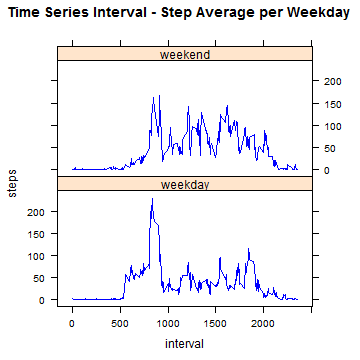

Date: 16-nov-2014

### Introduction:
Actually it's possible to collect data about personal movement using activity monitoring devices such as a Fitbit, Nike Fuelband, or Jawbone Up. 

This research use data from a personal activity monitoring device. It collects data at 5 minute intervals through out the day. 

The data consists of two months of data (October - November 2012) and include the number of steps taken in 5 minute intervals each day.

### DataSet

```r
html <- "https://d396qusza40orc.cloudfront.net/repdata%2Fdata%2Factivity.zip"
cat(paste("[Activity Monitoring Data](",html,")",sep=""))
```

[Activity Monitoring Data](https://d396qusza40orc.cloudfront.net/repdata%2Fdata%2Factivity.zip)

### DataSet Variables:
- steps: number of steps taking in a 5-minute interval
- date: date on which the measurement was taken (YYYY-MM-DD format)
- interval: identifier for the 5-minute interval in which measurement was taken
- missing values: coded as NA


```r
library(data.table)
library(plyr)
library(ggplot2)
library(timeDate)
library(lattice)
library(xtable)
library(knitr)
```

### DataSet Analysis with NA Values:


```r
rm(list = ls())
```


```r
dir.create("data")              # Source Data
dir.create("html")              # html files
dir.create("md")                # md files
dir.create("reports")           # Reports
dir.create("script")            # script files
```


```r
file <- "test.dat"

# Get Temporary Directory
tmpdir <- tempdir()
```


```r
setwd("./data")
unzip("repdata_data_activity.zip", exdir = tmpdir)

# Get / Define path & name of the unzipped
activity_name <- paste(tmpdir, "activity.csv", sep = "\\")

DT <- read.csv(activity_name, header = TRUE)
```


```r
xt <- xtable(head(DT, 10))
print(xt, type = "html")
```

<!-- html table generated in R 3.1.2 by xtable 1.7-4 package -->
<!-- Wed Nov 19 16:38:48 2014 -->
<table border=1>
<tr> <th>  </th> <th> steps </th> <th> date </th> <th> interval </th>  </tr>
  <tr> <td align="right"> 1 </td> <td align="right">  </td> <td> 2012-10-01 </td> <td align="right">   0 </td> </tr>
  <tr> <td align="right"> 2 </td> <td align="right">  </td> <td> 2012-10-01 </td> <td align="right">   5 </td> </tr>
  <tr> <td align="right"> 3 </td> <td align="right">  </td> <td> 2012-10-01 </td> <td align="right">  10 </td> </tr>
  <tr> <td align="right"> 4 </td> <td align="right">  </td> <td> 2012-10-01 </td> <td align="right">  15 </td> </tr>
  <tr> <td align="right"> 5 </td> <td align="right">  </td> <td> 2012-10-01 </td> <td align="right">  20 </td> </tr>
  <tr> <td align="right"> 6 </td> <td align="right">  </td> <td> 2012-10-01 </td> <td align="right">  25 </td> </tr>
  <tr> <td align="right"> 7 </td> <td align="right">  </td> <td> 2012-10-01 </td> <td align="right">  30 </td> </tr>
  <tr> <td align="right"> 8 </td> <td align="right">  </td> <td> 2012-10-01 </td> <td align="right">  35 </td> </tr>
  <tr> <td align="right"> 9 </td> <td align="right">  </td> <td> 2012-10-01 </td> <td align="right">  40 </td> </tr>
  <tr> <td align="right"> 10 </td> <td align="right">  </td> <td> 2012-10-01 </td> <td align="right">  45 </td> </tr>
   </table>
     
Note: missing values on table are NA


```r
# Column Names
# steps: # of steps taking in a 5-minute interval (missing values are coded as NA)
# date: the date on which the measurement was taken in YYYY-MM-DD format
# interval: identifier for the 5-minute interval in which measurement was taken

# Obtain Column Classes - Changing Classes
classes <- (sapply(DT, class))
classes

# steps      date  interval 
# "integer"  "factor" "integer" 

# Convert Dates -Symbol Meaning:
# %d: day as a number (0-31)  01-31 
# %a: abbreviated weekday (Mon) - %A: unabbreviated weekday (Monday)
# %m:  month (00-12)  00-12 
# %b: abbreviated month (Jan) - %B abbreviated month (January)
# %y: 2-digit year (07) - %Y: 4-digit year (2007)

DT$date <- as.Date(DT$date, "%Y-%m-%d")

# Max - Min Date Values
minValue <- DT[which.min(DT$date), ]
maxValue <- DT[which.max(DT$date), ]

# Extracts the day - month - year for each date on separte Columns
extractdate <- function(date) {
        day <- format(date, format="%d")
        month <- format(date, format="%m")
        year <- format(date, format="%Y")
        
        cbind(day, month, year)
}

DT <- cbind(DT, extractdate(DT$date))
```


```r
# Create vector for the required column names (steps - day)
colNames <- c("steps", "day")

# Create the Data Table with the required columns
DT1 <- tempfile()
DT1 <- DT[ , colNames]
```


```r
stepMean1 <- ddply(DT1, c("day"), numcolwise(mean), na.rm = TRUE)

write.table(stepMean1, "./reports/stepMean1.txt", row.names = FALSE , sep = "\t")
```


```r
stepsList1 <- sort(DT1$steps, decreasing = FALSE)        # Sort
stepsList1 <- stepsList1[!is.na(stepsList1)]             # Remove NA values

stepMedian1 <- median(stepsList1)                        # Calculates the median

write.table(stepMedian1, "./reports/stepMedian1.txt", row.names = FALSE , sep = "\t")
```

#### Mean Total Number of Steps taken per day (with NA Values)

```r
xt <- xtable(stepMean1[seq(1, nrow(stepMean1), by = 3), ], include.rownames=FALSE)
print(xt, type = "html")
```

<!-- html table generated in R 3.1.2 by xtable 1.7-4 package -->
<!-- Wed Nov 19 16:38:50 2014 -->
<table border=1>
<tr> <th>  </th> <th> day </th> <th> steps </th>  </tr>
  <tr> <td align="right"> 1 </td> <td> 01 </td> <td align="right">  </td> </tr>
  <tr> <td align="right"> 4 </td> <td> 04 </td> <td align="right"> 42.07 </td> </tr>
  <tr> <td align="right"> 7 </td> <td> 07 </td> <td align="right"> 41.49 </td> </tr>
  <tr> <td align="right"> 10 </td> <td> 10 </td> <td align="right"> 34.38 </td> </tr>
  <tr> <td align="right"> 13 </td> <td> 13 </td> <td align="right"> 34.31 </td> </tr>
  <tr> <td align="right"> 16 </td> <td> 16 </td> <td align="right"> 35.63 </td> </tr>
  <tr> <td align="right"> 19 </td> <td> 19 </td> <td align="right"> 35.89 </td> </tr>
  <tr> <td align="right"> 22 </td> <td> 22 </td> <td align="right"> 58.83 </td> </tr>
  <tr> <td align="right"> 25 </td> <td> 25 </td> <td align="right"> 24.87 </td> </tr>
  <tr> <td align="right"> 28 </td> <td> 28 </td> <td align="right"> 37.57 </td> </tr>
  <tr> <td align="right"> 31 </td> <td> 31 </td> <td align="right"> 53.52 </td> </tr>
   </table>
     
Note: missing values on table are NA

#### Media Total Number of Steps taken per day (with NA Values)

```r
data <- stepMedian1
```
     
The media of the total number of steps taken per day (with NA Values) is 0.

#### Histogram Total Number of Steps taken per day (with NA Values)

```r
# Create vector for the required column names (steps - day)
colNames <- c("steps", "day")

# Create the Data Table with the required columns
DT1 <- tempfile()
DT1 <- DT[ , colNames]

# Max - Min Date Values
minValue <- DT1[which.min(DT$day), ]
maxValue <- DT1[which.max(DT$day), ]

# Creates Data Set for Histogram
steps_day_act1 <- ddply(DT1, c("day"), numcolwise(sum))
```


```r
g1 <- ggplot(steps_day_act1, aes(x = day, weight = steps)) + geom_histogram(colour = "darkgreen", fill = "blue", binwidth = 2, alpha=.8, position = "identity") + labs(title = "Total Steps per Day with NA Values") + labs(x = "Day", y = "Steps")

g1
```

 


```r
# Create vector for the required column names (steps - day)
colNames <- c("day", "interval", "steps")

# Create the Data Table with the required columns
DT1 <- tempfile()
DT1 <- DT[ , colNames]
DT1$day <- as.numeric(DT1$day)

# Creates Data Set for Time Series Plot
# 31days x (24hours x 60min)/5min = 8928 Observations
steps_ave_act1 <- as.data.table(ddply(DT1, c("day", "interval"), numcolwise(mean)))

write.table(steps_ave_act1, "./reports/steps_ave_act1.txt", row.names = FALSE , 
            sep = "\t")

# Change Column Names on final Data Set
colNames <- c("day", "interval", "avg_steps")
setnames(steps_ave_act1, colNames)

# Max - Min Date Values
minValue <- steps_ave_act1[which.min(steps_ave_act1$avg_steps), ]
maxValue <- steps_ave_act1[which.max(steps_ave_act1$avg_steps), ]

#  Select data for checking
index <- which(steps_ave_act1$day == 2 & steps_ave_act1$interval == 805)
checkValue <- steps_ave_act1[index, avg_steps]
```

#### Time Series Average Number of Steps taken per day vs Interval (with NA Values)

```r
with(steps_ave_act1, plot(steps_ave_act1$interval, steps_ave_act1$avg_steps , 
                          type = "l", xlab = "Interval", ylab = "Steps Average per Day ", 
                          main = "Time Series Interval - Step Average", pch = 20, 
                          col = "blue", axe = TRUE))
```

 

```r
model <- lm(avg_steps ~ interval, steps_ave_act1)
```

#### Results (with NA Values):

```r
maxValue <- steps_ave_act1[which.max(steps_ave_act1$avg_steps), ] #Calculation of the 5-minute interval with maximal number of Steps

cat("Report 1 - with NA Values", file = "./reports/report1.txt", sep="\n")
cat("", file = "./reports/report1.txt", sep="\n", append = TRUE)

cat("- Step Mean Table:", file = "./reports/report1.txt", sep="\n", append = TRUE)
write.table(stepMean1, "./reports/report1.txt", append = TRUE, row.names = FALSE , 
            sep = "\t")
cat("", file = "./reports/report1.txt", sep="\n", append = TRUE)

cat(paste("- Step Median =", stepMedian1), file = "./reports/report1.txt", sep="\n", 
    append = TRUE)
cat("", file = "./reports/report1.txt", sep="\n", append = TRUE)

cat(paste("- Max. Day =", day <- maxValue[, day]), file = "./reports/report1.txt", 
    sep="\n", append = TRUE)
cat("", file = "./reports/report1.txt", sep="\n", append = TRUE)

cat(paste("- Max. Interval =", interval <- maxValue[, interval]), 
    file = "./reports/report1.txt", sep="\n", append=TRUE)
cat("", file = "./reports/report1.txt", sep="\n", append = TRUE)

cat(paste("- Max. Steps =", steps <- maxValue[, avg_steps]), 
    file = "./reports/report1.txt", sep="\n", append=TRUE)
cat("", file = "./reports/report1.txt", sep="\n", append = TRUE)
```

#### Maximum Number of Steps per 5-minute interval (with NA Values)

```r
day <- maxValue[, day]
interval <- maxValue[, interval]
steps <- maxValue[, avg_steps]
```
     
The Maximum Number of Steps per 5-minute interval (with NA Values) is:

- Maximum Day:          31.

- Maximum Interval:     730.

- Maximum # of Steps:   757.

#### Missing Values:

```r
# Counting the occurrence of NA per Column
colNames <- colnames(DT)
loopLength <- length(colNames)

for (i in 1:loopLength){
        naValues <- sum(is.na(DT[ , i]))
        cat(paste("- Max. NA Values", colNames[i], "=", naValues), 
            file = "./reports/report1.txt", sep="\n", append = TRUE)
        cat("", file = "./reports/report1.txt", sep="\n", append = TRUE)
}
```


```r
# Create vector for the required column names (steps - day)
colNames <- c("interval", "steps")

# Create Data Table with the required columns
DT1 <- tempfile()
DT1 <- DT[ , colNames]

# Create Data Table with the mean per 5-minute interval
steps_ave_interval <- as.data.table(ddply(DT1, c("interval"), numcolwise(mean), 
                                          na.rm = TRUE))

write.table(steps_ave_interval, "./reports/steps_ave_interval.txt", row.names 
            = FALSE , sep = "\t")

# Change Column Names on final Data Set
colNames <- c("interval", "avg_steps")
setnames(steps_ave_interval, colNames)

# Max - Min Date Values
minValue <- steps_ave_interval[which.min(steps_ave_interval$avg_steps), ]
maxValue <- steps_ave_interval[which.max(steps_ave_interval$avg_steps), ]

# Initial NA Values - NA Values
naValuesIni <- sum(is.na(DT[ ,1]))

DT1 <- tempfile()
DT1 <- DT

DT1$day <- as.numeric(DT1$day)
DT1$month <- as.numeric(DT1$month)
DT1$year <- as.numeric(DT1$year)

# DT colnames: (1) steps - (2) date - (3) interval - (4) day - (5) month - (6) year
setkey(steps_ave_interval,interval)

# Create new dataset that is equal to the original dataset but with the missing 
# data filled in (mean value)
rowNumber <- nrow(DT1)

for (i in 1:rowNumber){
        cond <- as.character(DT1[i, 1])
                
        if(is.na(DT1[i, 1])){
                # Obtain the interval value (0 - 1440), where there is a NA Value
                intervalValue <- DT1[i, 3]
                
                # Obtain the replacement interval value (mean per interval value)
                replaceInterval <- steps_ave_interval[J(intervalValue)]         
                replaceInterval <-  replaceInterval[1, avg_steps]
                
                # Replace the NA Value by the replacement interval
                DT1[i, 1] <- replaceInterval
        }
}
```


```r
naValuesIni <- sum(is.na(DT[ ,1]))
naValuesEnd <- sum(is.na(DT1[ ,1]))
```

- Initial Missing Values = 2304.

- Final Missing Values = 0.

### DataSet Analysis without NA Values:
    
Remarks: replacing NA Values with the Mean per Time Interval


```r
#  Select data for checking
index <- which(DT1$date == "2012-10-18" & DT1$interval == 555)
checkValue <- DT1[index, "steps"]

# Mean Total Number of steps taken per day
#------------------------------------------------------------------------------
# Create vector for the required column names (steps - day)
colNames <- c("steps", "day")

# Create the Data Table with the required columns
DT2 <- tempfile()
DT2 <- DT1[ , colNames]

stepMean2 <- ddply(DT2, c("day"), numcolwise(mean), na.rm = TRUE)

# Median Total Number of steps taken per day
stepsList2 <- sort(DT2$steps, decreasing = FALSE)         # Sort
stepsList2 <- stepsList2[!is.na(stepsList2)]             # Remove NA values

stepMedian2 <- median(stepsList2)                       # Calculates the median

# Report / Write Data - Table
write.table(stepMean2, "./reports/stepMean2.txt", row.names = FALSE , sep = "\t")
write.table(stepMedian2, "./reports/stepMedian2.txt", row.names = FALSE , sep = "\t")

# Max - Min Date Values
minValue <- DT2[which.min(DT2$day), ]
maxValue <- DT2[which.max(DT2$day), ]
```

#### Mean Total Number of Steps taken per day (without NA Values)

```r
xt <- xtable(stepMean2[seq(1, nrow(stepMean2), by = 3), ], include.rownames=FALSE)
print(xt, type = "html")
```

<!-- html table generated in R 3.1.2 by xtable 1.7-4 package -->
<!-- Wed Nov 19 16:39:29 2014 -->
<table border=1>
<tr> <th>  </th> <th> day </th> <th> steps </th>  </tr>
  <tr> <td align="right"> 1 </td> <td align="right"> 1.00 </td> <td align="right"> 37.38 </td> </tr>
  <tr> <td align="right"> 4 </td> <td align="right"> 4.00 </td> <td align="right"> 39.73 </td> </tr>
  <tr> <td align="right"> 7 </td> <td align="right"> 7.00 </td> <td align="right"> 41.49 </td> </tr>
  <tr> <td align="right"> 10 </td> <td align="right"> 10.00 </td> <td align="right"> 35.88 </td> </tr>
  <tr> <td align="right"> 13 </td> <td align="right"> 13.00 </td> <td align="right"> 34.31 </td> </tr>
  <tr> <td align="right"> 16 </td> <td align="right"> 16.00 </td> <td align="right"> 35.63 </td> </tr>
  <tr> <td align="right"> 19 </td> <td align="right"> 19.00 </td> <td align="right"> 35.89 </td> </tr>
  <tr> <td align="right"> 22 </td> <td align="right"> 22.00 </td> <td align="right"> 58.83 </td> </tr>
  <tr> <td align="right"> 25 </td> <td align="right"> 25.00 </td> <td align="right"> 24.87 </td> </tr>
  <tr> <td align="right"> 28 </td> <td align="right"> 28.00 </td> <td align="right"> 37.57 </td> </tr>
  <tr> <td align="right"> 31 </td> <td align="right"> 31.00 </td> <td align="right"> 53.52 </td> </tr>
   </table>

#### Media Total Number of Steps taken per day (without NA Values)

```r
data <- stepMedian2
```
    
The media of the total number of steps taken per day (without NA Values) is 0.


```r
# Creates Data Set for Histogram
steps_day_act2 <- ddply(DT2, c("day"), numcolwise(sum))
```

#### Histogram Total Number of Steps taken per day (without NA Values)

```r
g2 <- ggplot(steps_day_act2, aes(x = day, weight = steps)) + geom_histogram(colour = "darkgreen", fill = "magenta", binwidth = 2, alpha=.8, position = "identity") + labs(title = "Total Steps per Day w/o NA Values") + labs(x = "Day", y = "Steps")

g2
```

 

#### Results (without NA Values):

```r
cat("Report 2 - replacing NA Values with the Mean per Time Interval", 
    file = "./reports/report2.txt", sep="\n")
cat("", file = "./reports/report2.txt", sep="\n", append = TRUE)

cat("- Step Mean Table:", file = "./reports/report2.txt", sep="\n", append = TRUE)
write.table(stepMean2, "./reports/report2.txt", append = TRUE, row.names = FALSE , sep = "\t")
cat("", file = "./reports/report2.txt", sep="\n", append = TRUE)

cat(paste("- Step Median =", stepMedian2), file = "./reports/report2.txt", sep="\n", 
    append = TRUE)
cat("", file = "./reports/report2.txt", sep="\n", append = TRUE)
```

#### Impact of inputting the Mean in NA Values

```r
stepMeanDiff <- as.data.table(stepMean2[ ,"steps"] - stepMean1[ ,"steps"])
stepMeanDiff <- stepMeanDiff[, day := stepMean2$day]

# Change Column Names on final Data Set
colNames <- c("steps_diff", "day")
setnames(stepMeanDiff, colNames)

setcolorder(stepMeanDiff, c("day", "steps_diff"))

write.table(stepMeanDiff, "./reports/stepMeanDiff.txt", row.names = FALSE , sep = "\t")
```


```r
xt <- xtable(stepMeanDiff[seq(1, nrow(stepMeanDiff), by = 3), ], include.rownames=FALSE)
print(xt, type = "html")
```

<!-- html table generated in R 3.1.2 by xtable 1.7-4 package -->
<!-- Wed Nov 19 16:39:30 2014 -->
<table border=1>
<tr> <th>  </th> <th> day </th> <th> steps_diff </th>  </tr>
  <tr> <td align="right"> 1 </td> <td align="right"> 1.00 </td> <td align="right">  </td> </tr>
  <tr> <td align="right"> 2 </td> <td align="right"> 4.00 </td> <td align="right"> -2.34 </td> </tr>
  <tr> <td align="right"> 3 </td> <td align="right"> 7.00 </td> <td align="right"> 0.00 </td> </tr>
  <tr> <td align="right"> 4 </td> <td align="right"> 10.00 </td> <td align="right"> 1.50 </td> </tr>
  <tr> <td align="right"> 5 </td> <td align="right"> 13.00 </td> <td align="right"> 0.00 </td> </tr>
  <tr> <td align="right"> 6 </td> <td align="right"> 16.00 </td> <td align="right"> 0.00 </td> </tr>
  <tr> <td align="right"> 7 </td> <td align="right"> 19.00 </td> <td align="right"> 0.00 </td> </tr>
  <tr> <td align="right"> 8 </td> <td align="right"> 22.00 </td> <td align="right"> 0.00 </td> </tr>
  <tr> <td align="right"> 9 </td> <td align="right"> 25.00 </td> <td align="right"> 0.00 </td> </tr>
  <tr> <td align="right"> 10 </td> <td align="right"> 28.00 </td> <td align="right"> 0.00 </td> </tr>
  <tr> <td align="right"> 11 </td> <td align="right"> 31.00 </td> <td align="right"> 0.00 </td> </tr>
   </table>
     
Note: missing values on table are NA


```r
impact_Days <- 31 - nrow(stepMeanDiff[stepMeanDiff$steps_diff == 0,])
```

##### Impact of inputting on missing data a value
     
The impact of inputing on missing data the interval mean  of th total daily number of step, is reflected in 7 days of the complete data set.

### Activity Patterns between weekdays and weekends

```r
#[1]: Create a new factor variable in the dataset filled with missing values with
# two levels - "weekday" / "weekend" indicating whether a given date is a weekday 
# or weekend day.

# Create vector for the required column names (steps - day)
colNames <- c("date", "interval", "steps")

# Create the Data Table with the required columns
DT2 <- tempfile()
DT2 <- DT1[ , colNames]
DT2 <- as.data.table(DT2)

rowNumber <- nrow(DT2)

for (i in 1:rowNumber){        
        if(isWeekday(DT2[i, date], wday = 1:5)){
                DT2[i, weekday := "weekday"]
        } else{
        DT2[i, weekday := "weekend"]
        }
}

# Change Column Names on final Data Set
colNames <- c("date", "interval", "steps", "weekday")
setnames(DT2, colNames)
setcolorder(DT2, c("date", "weekday", "interval", "steps"))

DT2$weekday <- as.factor(DT2$weekday)

#  Select data for checking
weekdayList <- c(DT2[ , weekday])
unique(weekdayList)

index <- which(DT2$date == "2012/11/11" & DT2$interval == 805)
checkValue <- DT2[index, weekday]
```


```r
# Creates Data Set for Time Series Plot
# 288 Intervals - Weekdays 2 (weekday - weekend) = 576 Observations
countweekDay <- sum(DT2$weekday == "weekday")
countweekEnd <- sum(DT2$weekday == "weekend")

steps_ave_act3 <- as.data.table(ddply(DT2, c("weekday", "interval"), 
                                      numcolwise(mean)))
```

#### Time Series Average Number of Steps taken per weekday vs Interval (without NA Values)

```r
xyplot(steps ~ interval | weekday, data = steps_ave_act3, type = "l", 
       main = "Time Series Interval - Step Average per Weekday", pch = 20, 
       col = "blue", axe = TRUE, layout = c(1, 2))
```

 

- There is a difference between activity on weekdays and weekends.

- The activity on weekends seems to be bigger than weekdays.
