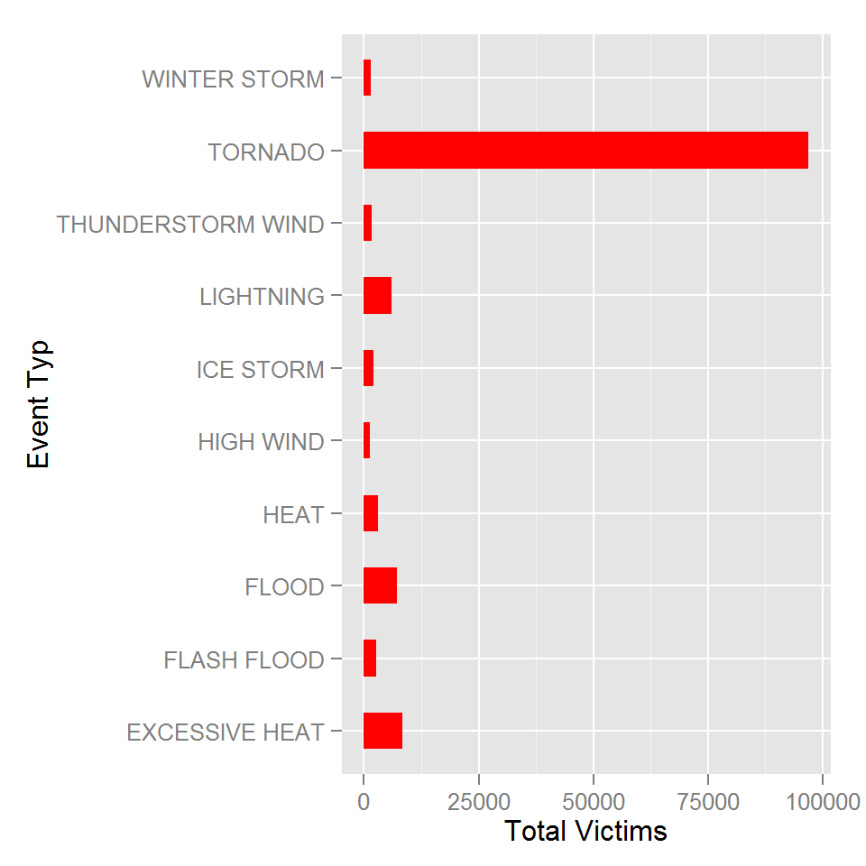
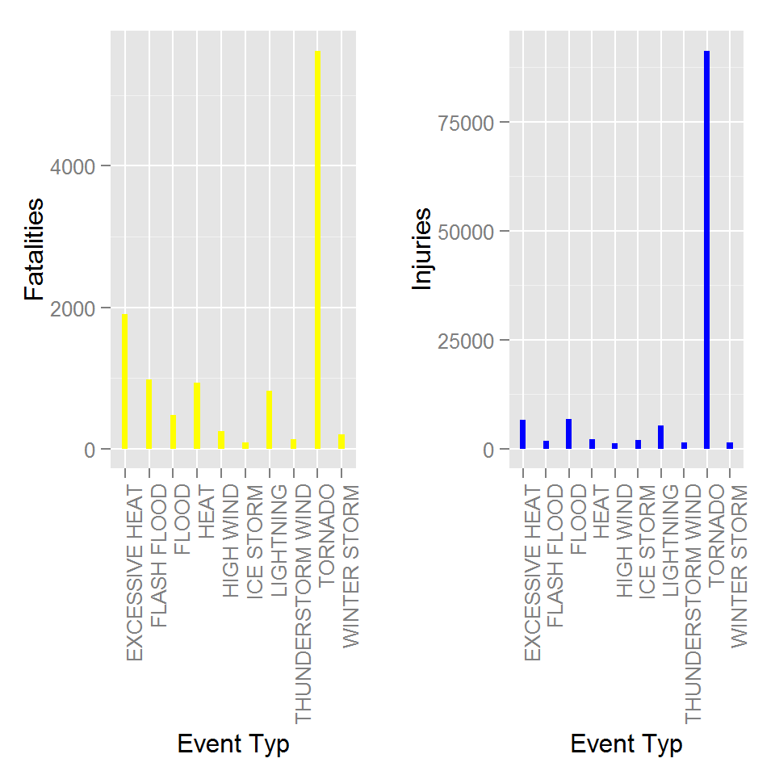
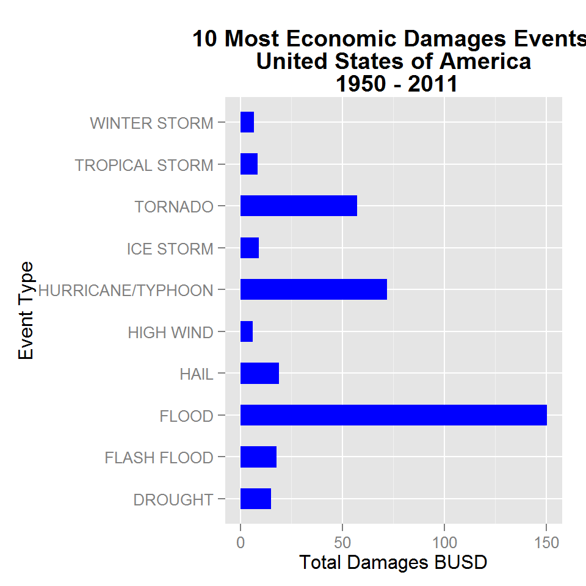

Version: V00

Date: 24-nov-2014

GitHub Repository: https://github.com/A6111E/datasciencecoursera/tree/master/Reproducible_Research/Assignment_2

Data Source: NATIONAL OCEANIC AND ATMOSPHERIC ADMINISTRATION (NOAA)

http://www.ncdc.noaa.gov/stormevents/

#### Synopsis:

- This study is based on the Storm Data from the National Oceanic and Atmospheric Administration (NOAA) in the United States. 

- Record Dates (%Y/%m/%d) between:      1950/01/03 - 2011/11/30

- Documents the occurrence of storms and other significant weather phenomena, with the sufficient intensity to cause loss of life, injuries, significant property damage, and/or disruption to commerce. 

Analysis Summary:

(1) Most Harmfull Events for the Population Heath:
- Event Type:           Tornado
- Fatalities:           5633
- Injuries:             91346
- Total Victims:        96979

(2) Economic Damages to Properties / Crop:
- Event Type:           Flood
- Fatalities:           470
- Injuries:             6789
- Property Damages:     144657.71 KUSD  
- Crop Damages:         5661.97 KUSD
- Total Damages:        150.32 BUSD

For more information, please refer to the reports folder on GitHub:
- Most_HarmFull_Events.txt
- Economic_Damages.txt

### Data Processing:

```r
library(data.table)             # Data Table
library(plyr)                   #
library(ggplot2)                # Plotting
library(timeDate)               # Converting Times / Dates
library(xtable)                 # For generating tables knitr
library(knitr)                  # Markdown
library(R.utils)                # Unzip bz2 Files
library(gridExtra)              # Grid for graphics
```

### knitr Setup:


```r
rm(list = ls())
```


```r
dir.create("data")              # Source Data
dir.create("docs")              # Document files
dir.create("reports")           # Report files

# Other Directories: created by code (graphs / cache)
```

### Download - Read DataSet

```r
tmpDir <- tempdir()             # Create Temporary Directory
tmpFile1 <- tempfile()          # Create Temporary File for zip File
tmpFile2 <- tempfile()          # Create Temporary File for csv File

# Define URL and download file
system.time({
fileUrl <- "http://d396qusza40orc.cloudfront.net/repdata%2Fdata%2FStormData.csv.bz2"
download.file(fileUrl, destfile = tmpFile1)
})
```

   user  system elapsed 
    2.9    14.9   275.5 

```r
system.time({
# Creates csv File for reading
bunzip2(filename = tmpFile1, destname = tmpFile2, remove = FALSE, overwrite = TRUE)
})
```

   user  system elapsed 
     57       2      60 

```r
system.time({
# Create Raw DataTable
DT <- tempfile()
DT <- read.csv(tmpFile2, as.is = TRUE, na.strings = "", header = TRUE)
})
```

   user  system elapsed 
  171.5     3.6   180.6 


```r
classes <- (sapply(DT, class))
classes
```

### DataSet:
Please refer to the following documents file on the "docs" folder on the GitHub Repository for more information:

- "repdata_peer2_doc_NCDC Storm Events-FAQ Page.pdf"
- "repdata_peer2_doc_pd01016005curr.pdf"

1. EVTYPE: types of events like storms or other significant weather phenomena (48 types of events) ("repdata_peer2_doc_pd01016005curr.pdf" - Chapter 7 - Page 18)

   NOAA: http://www.ncdc.noaa.gov/stormevents/details.jsp?type=eventtype

2. FATALITIES: fatalities directly caused by weather events 

3. INJURIES: injuries directly caused by weather events

4. PROPDMG:estimated damages to properties. Refers to damage inflicted to private property (structures, objects, vegetation), as well as public infrastructure and facilities. 

5. CROPDMG: estimated damages to crop, obtained from reliable sources, such as the U.S. Department of Agriculture (USDA).

6. PROPDMGEXP / CROPDMGEXP: estimates rounded to three significant digits, followed by an alphabetical character signifying the magnitude of the number:

a. "Hh" for hundreds
b. "Kk" for thousands
c. "Mm" for millions
d. "Bb" for billions

#### Event Types

- According with the NOAA documentation, there are 48 event types (EVTYPE)
- The raw Storm Database, has 985 different event types (possible cause: typing errors) 
- On the "docs" folder on GitHub, it's possible to find the file "EVTYPE.txt"
- This file was used for debbuging the raw data.
- Initial Observations = 902297
- Final Observations after debbuging = 629694
- Aproximately 30% of the initial observations were avoid. 
- Without this debugging procedure, the analysis would have mistakes.


```r
# Reading txt file with the 48 event types (EVTYPE)
EVTYPE <- read.table("./docs/EVTYPE.txt", sep = ",", header = FALSE, strip.white =TRUE)

# Convert to a Vector
EVTYPE_vector <- EVTYPE[ ,"V1"]
```

#### Tidy DataSet

```r
system.time({
DT1 <- DT[DT$EVTYPE %in% EVTYPE_vector, ]

# For checking
list <- unique(DT1[, "EVTYPE"])
# list

DT <- DT1       # Tidy DataSet

classes <- (sapply(DT, class))
classes               # Delete the # to execute

# Convert Dates -Symbol Meaning:
# %d: day as a number (0-31)  01-31 
# %a: abbreviated weekday (Mon) - %A: unabbreviated weekday (Monday)
# %m:  month (00-12)  00-12 
# %b: abbreviated month (Jan) - %B abbreviated month (January)
# %y: 2-digit year (07) - %Y: 4-digit year (2007)

DT$BGN_DATE <- as.Date(DT$BGN_DATE, "%m/%d/%Y")
})

# Research Dates
# Max - Min Date Values
minValue <- DT[which.min(DT$BGN_DATE), ]
maxValue <- DT[which.max(DT$BGN_DATE), ]

rm(DT1)         # remove from environment
```

#### Table: NOAA Storm DataBase Summary

```r
xt <- xtable(DT[1:10, c(6:8, 23:27, 32:33)], digits = 0)
print(xt, type = "html", include.rownames = FALSE, hline.after=c(1), floating = FALSE)
```

<!-- html table generated in R 3.1.2 by xtable 1.7-4 package -->
<!-- Wed Nov 26 15:55:53 2014 -->
<table border=1>
<tr> <th> COUNTYNAME </th> <th> STATE </th> <th> EVTYPE </th> <th> FATALITIES </th> <th> INJURIES </th> <th> PROPDMG </th> <th> PROPDMGEXP </th> <th> CROPDMG </th> <th> LATITUDE </th> <th> LONGITUDE </th>  </tr>
 <tr> <td> MOBILE </td> <td> AL </td> <td> TORNADO </td> <td align="right"> 0 </td> <td align="right"> 15 </td> <td align="right"> 25 </td> <td> K </td> <td align="right"> 0 </td> <td align="right"> 3040 </td> <td align="right"> 8812 </td> </tr>
   <tr> <td> BALDWIN </td> <td> AL </td> <td> TORNADO </td> <td align="right"> 0 </td> <td align="right"> 0 </td> <td align="right"> 2 </td> <td> K </td> <td align="right"> 0 </td> <td align="right"> 3042 </td> <td align="right"> 8755 </td> </tr>
  <tr> <td> FAYETTE </td> <td> AL </td> <td> TORNADO </td> <td align="right"> 0 </td> <td align="right"> 2 </td> <td align="right"> 25 </td> <td> K </td> <td align="right"> 0 </td> <td align="right"> 3340 </td> <td align="right"> 8742 </td> </tr>
  <tr> <td> MADISON </td> <td> AL </td> <td> TORNADO </td> <td align="right"> 0 </td> <td align="right"> 2 </td> <td align="right"> 2 </td> <td> K </td> <td align="right"> 0 </td> <td align="right"> 3458 </td> <td align="right"> 8626 </td> </tr>
  <tr> <td> CULLMAN </td> <td> AL </td> <td> TORNADO </td> <td align="right"> 0 </td> <td align="right"> 2 </td> <td align="right"> 2 </td> <td> K </td> <td align="right"> 0 </td> <td align="right"> 3412 </td> <td align="right"> 8642 </td> </tr>
  <tr> <td> LAUDERDALE </td> <td> AL </td> <td> TORNADO </td> <td align="right"> 0 </td> <td align="right"> 6 </td> <td align="right"> 2 </td> <td> K </td> <td align="right"> 0 </td> <td align="right"> 3450 </td> <td align="right"> 8748 </td> </tr>
  <tr> <td> BLOUNT </td> <td> AL </td> <td> TORNADO </td> <td align="right"> 0 </td> <td align="right"> 1 </td> <td align="right"> 2 </td> <td> K </td> <td align="right"> 0 </td> <td align="right"> 3405 </td> <td align="right"> 8631 </td> </tr>
  <tr> <td> TALLAPOOSA </td> <td> AL </td> <td> TORNADO </td> <td align="right"> 0 </td> <td align="right"> 0 </td> <td align="right"> 2 </td> <td> K </td> <td align="right"> 0 </td> <td align="right"> 3255 </td> <td align="right"> 8558 </td> </tr>
  <tr> <td> TUSCALOOSA </td> <td> AL </td> <td> TORNADO </td> <td align="right"> 1 </td> <td align="right"> 14 </td> <td align="right"> 25 </td> <td> K </td> <td align="right"> 0 </td> <td align="right"> 3334 </td> <td align="right"> 8740 </td> </tr>
  <tr> <td> FAYETTE </td> <td> AL </td> <td> TORNADO </td> <td align="right"> 0 </td> <td align="right"> 0 </td> <td align="right"> 25 </td> <td> K </td> <td align="right"> 0 </td> <td align="right"> 3336 </td> <td align="right"> 8738 </td> </tr>
  </table>

### Results Analysis:

#### [1] Types of Events (EVTYPE) - Most Harmful with respect to the Population Health

```r
system.time({ 
# Create vector for the required column names (EVTYPE - FATALITIES- INJURIES)
colNames <- c("EVTYPE", "FATALITIES", "INJURIES")

# Create the Data Table with the required columns
DT1 <- DT[ , colNames]

fatalitiesSum <- ddply(DT1, .(EVTYPE), summarise, Fatalities = sum(FATALITIES))
injuriesSum <- ddply(DT1, .(EVTYPE), summarise, Injuries = sum(INJURIES))

victims  <- data.table(merge(fatalitiesSum,injuriesSum))

victims <- victims[ , Total_Victims := Fatalities + Injuries]

victims <- arrange(victims,desc(Total_Victims))

setnames(victims, c("Event_Type", "Fatalities","Injuries","Total_Victims"))

write.table(victims, "./reports/Most_Harmfull_Events.txt", row.names = FALSE , 
            sep = ",")
})
```

#### Table: Most Harmfull Events for the Population Health Summary

```r
xt <- xtable(victims[1:10, ], digits = 0)
print(xt, type = "html", include.rownames = FALSE, hline.after=c(1), floating = FALSE)
```

<!-- html table generated in R 3.1.2 by xtable 1.7-4 package -->
<!-- Wed Nov 26 15:55:58 2014 -->
<table border=1>
<tr> <th> Event_Type </th> <th> Fatalities </th> <th> Injuries </th> <th> Total_Victims </th>  </tr>
 <tr> <td> TORNADO </td> <td align="right"> 5633 </td> <td align="right"> 91346 </td> <td align="right"> 96979 </td> </tr>
   <tr> <td> EXCESSIVE HEAT </td> <td align="right"> 1903 </td> <td align="right"> 6525 </td> <td align="right"> 8428 </td> </tr>
  <tr> <td> FLOOD </td> <td align="right"> 470 </td> <td align="right"> 6789 </td> <td align="right"> 7259 </td> </tr>
  <tr> <td> LIGHTNING </td> <td align="right"> 816 </td> <td align="right"> 5230 </td> <td align="right"> 6046 </td> </tr>
  <tr> <td> HEAT </td> <td align="right"> 937 </td> <td align="right"> 2100 </td> <td align="right"> 3037 </td> </tr>
  <tr> <td> FLASH FLOOD </td> <td align="right"> 978 </td> <td align="right"> 1777 </td> <td align="right"> 2755 </td> </tr>
  <tr> <td> ICE STORM </td> <td align="right"> 89 </td> <td align="right"> 1975 </td> <td align="right"> 2064 </td> </tr>
  <tr> <td> THUNDERSTORM WIND </td> <td align="right"> 133 </td> <td align="right"> 1488 </td> <td align="right"> 1621 </td> </tr>
  <tr> <td> WINTER STORM </td> <td align="right"> 206 </td> <td align="right"> 1321 </td> <td align="right"> 1527 </td> </tr>
  <tr> <td> HIGH WIND </td> <td align="right"> 248 </td> <td align="right"> 1137 </td> <td align="right"> 1385 </td> </tr>
  </table>

#### Graphic: 10 Most Harmfull Events for the Population Health in the United States of America Years: 1950 - 2011

```r
# First plot
ggplot(head(victims, 10), aes(x = Event_Type, y = Total_Victims)) + geom_bar(stat = "identity", fill = "red", width = 0.5) + labs(x = "Event Typ", y = "Total Victims") + coord_flip()
```

 

```r
# Second plot  
p2 <- ggplot(head(victims, 10), aes(x = Event_Type, y = Fatalities)) + geom_bar(stat = "identity", fill = "yellow", width = 0.25) + labs(x = "Event Typ", y = "Fatalities") + theme(axis.text.x = element_text(angle = 90, hjust = 1))

# Third plot 
p3 <- ggplot(head(victims, 10), aes(x = Event_Type, y = Injuries)) + geom_bar(stat = "identity", fill = "blue", width = 0.25) + labs(x = "Event Typ", y = "Injuries") + theme(axis.text.x = element_text(angle = 90, hjust = 1))

grid.arrange(p2, p3, ncol = 2)
```

 


```r
event_type <- victims[1, Event_Type]
fatalities <- (max(victims$Fatalities))
injuries <- (max(victims$Injuries))
total <- (max(victims$Total_Victims))
```
     
Across the United States, the top most harmful weather events with respect to population health are:

- Event Type:           TORNADO
- Total Fatalities:     5633
- Total Injuries:       91346
- Total Victims:        96979

#### [2] Events - Economic Damages

```r
# Create vector for the required column names (EVTYPE - FATALITIES- INJURIES)
colNames <- c("EVTYPE", "FATALITIES", "INJURIES", "PROPDMG", "PROPDMGEXP", "CROPDMG", 
              "CROPDMGEXP")

# Create the Data Table with the required columns
DT1 <- data.table(DT[ , colNames])
```


```r
classes <- (sapply(DT1, class))
# classes               # Delete the # to execute

list <- unique(DT1[, PROPDMGEXP])
# list                # Delete the # to execute

list <- unique(DT1[, CROPDMGEXP])
# list                # Delete the # to execute
```

Remarks: 

- The damage amounts are received from a variety of sources. 
- Property and Crop damage should be considered as a broad estimate. 
- Alphabetical characters used are "Hh" for hundreds, Kk" for thousands, "Mm" for millions, and "Bb" for billions.
- Other characters are not included on this analysis.


```r
system.time({
# PROPDMG - CROPDMG: changing exponencial letter by values & debugging dataset
DT1$PROPDMGEXP <- gsub("^[Hh]$","100", DT1$PROPDMGEXP)
DT1$PROPDMGEXP <- gsub("^[Kk]$","1000", DT1$PROPDMGEXP)
DT1$PROPDMGEXP <- gsub("^[Mm]$","1000000", DT1$PROPDMGEXP)
DT1$PROPDMGEXP <- gsub("^[Bb]$","1000000000", DT1$PROPDMGEXP)

DT1$PROPDMGEXP <- gsub("^[+ | 0 | 5 | 2 | 4 | 7 | ? | - | 6 | 3 | 1 | 8]$","1", 
                       DT1$PROPDMGEXP)

DT1$PROPDMGEXP <- gsub("^[-]$","1", DT1$PROPDMGEXP)

DT1$CROPDMGEXP <- gsub("^[Hh]$","100", DT1$CROPDMGEXP)
DT1$CROPDMGEXP <- gsub("^[Kk]$","1000", DT1$CROPDMGEXP)
DT1$CROPDMGEXP <- gsub("^[Mm]$","1000000", DT1$CROPDMGEXP)
DT1$CROPDMGEXP <- gsub("^[Bb]$","1000000000", DT1$CROPDMGEXP)

DT1$CROPDMGEXP <- gsub("^[0]$","1", DT1$CROPDMGEXP)

DT1[is.na(DT1)]<-1
})

# Check
list <- unique(DT1[, PROPDMGEXP])
# list                # Delete the # to execute

list <- unique(DT1[, CROPDMGEXP])
# list                # Delete the # to execute
```


```r
# Calculate Total Damages
# To Properties
DT1$Total_Prop_Damages_MUSD <- (as.numeric(DT1$PROPDMGEXP) * DT1$PROPDMG) / 1e6

# To Crop
DT1$Total_Crop_Damages_MUSD <- (as.numeric(DT1$CROPDMGEXP) * DT1$CROPDMG) / 1e6

# Total Damages
DT1$Total_Damages_BUSD <- (DT1$Total_Prop_Damages + DT1$Total_Crop_Damages) / 1e3
```


```r
# Final DataSet
colNames <- c("EVTYPE", "FATALITIES", "INJURIES", "Total_Prop_Damages_MUSD", 
              "Total_Crop_Damages_MUSD", "Total_Damages_BUSD")
DT2 <- DT1[ , colNames, with = FALSE]
```


```r
economic_damages <- ddply(DT2, .(EVTYPE), numcolwise(sum))

# Cross Check
list <- unique(economic_damages[ ,"EVTYPE"])
# list                # Delete the # to execute

list <- unique(economic_damages[ ,"Total_Damages_BUSD"])
# list                # Delete the # to execute

economic_damages <- arrange(economic_damages,desc(Total_Damages_BUSD))

write.table(economic_damages, "./reports/Economic_Damages.txt", row.names = FALSE , 
            sep = ",")
```

#### Table: Total Economic Damages 

```r
xt <- xtable(economic_damages[1:10, ], digits = 2)
print(xt, type = "html", include.rownames = FALSE, hline.after=c(1), floating = FALSE)
```

<!-- html table generated in R 3.1.2 by xtable 1.7-4 package -->
<!-- Wed Nov 26 15:56:26 2014 -->
<table border=1>
<tr> <th> EVTYPE </th> <th> FATALITIES </th> <th> INJURIES </th> <th> Total_Prop_Damages_MUSD </th> <th> Total_Crop_Damages_MUSD </th> <th> Total_Damages_BUSD </th>  </tr>
 <tr> <td> FLOOD </td> <td align="right"> 470.00 </td> <td align="right"> 6789.00 </td> <td align="right"> 144657.71 </td> <td align="right"> 5661.97 </td> <td align="right"> 150.32 </td> </tr>
   <tr> <td> HURRICANE/TYPHOON </td> <td align="right"> 64.00 </td> <td align="right"> 1275.00 </td> <td align="right"> 69305.84 </td> <td align="right"> 2607.87 </td> <td align="right"> 71.91 </td> </tr>
  <tr> <td> TORNADO </td> <td align="right"> 5633.00 </td> <td align="right"> 91346.00 </td> <td align="right"> 56937.16 </td> <td align="right"> 414.95 </td> <td align="right"> 57.35 </td> </tr>
  <tr> <td> HAIL </td> <td align="right"> 15.00 </td> <td align="right"> 1361.00 </td> <td align="right"> 15732.27 </td> <td align="right"> 3025.95 </td> <td align="right"> 18.76 </td> </tr>
  <tr> <td> FLASH FLOOD </td> <td align="right"> 978.00 </td> <td align="right"> 1777.00 </td> <td align="right"> 16140.81 </td> <td align="right"> 1421.32 </td> <td align="right"> 17.56 </td> </tr>
  <tr> <td> DROUGHT </td> <td align="right"> 0.00 </td> <td align="right"> 4.00 </td> <td align="right"> 1046.11 </td> <td align="right"> 13972.57 </td> <td align="right"> 15.02 </td> </tr>
  <tr> <td> ICE STORM </td> <td align="right"> 89.00 </td> <td align="right"> 1975.00 </td> <td align="right"> 3944.93 </td> <td align="right"> 5022.11 </td> <td align="right"> 8.97 </td> </tr>
  <tr> <td> TROPICAL STORM </td> <td align="right"> 58.00 </td> <td align="right"> 340.00 </td> <td align="right"> 7703.89 </td> <td align="right"> 678.35 </td> <td align="right"> 8.38 </td> </tr>
  <tr> <td> WINTER STORM </td> <td align="right"> 206.00 </td> <td align="right"> 1321.00 </td> <td align="right"> 6688.50 </td> <td align="right"> 26.94 </td> <td align="right"> 6.72 </td> </tr>
  <tr> <td> HIGH WIND </td> <td align="right"> 248.00 </td> <td align="right"> 1137.00 </td> <td align="right"> 5270.05 </td> <td align="right"> 638.57 </td> <td align="right"> 5.91 </td> </tr>
  </table>


```r
event_type <- economic_damages[1, "EVTYPE"]
total <- (max(economic_damages$Total_Damages_BUSD))
```
     
Across the United States, the top most harmful weather events with respect to the economci consequeneces are:

- Event Type:           FLOOD 
- Total Damages:        150.32 BUSD     

#### Graphic: Total Economic Damages

```r
g1 <- ggplot(head(economic_damages, 10), aes(x = EVTYPE, y = Total_Damages_BUSD)) + geom_bar(stat = "identity", fill = "blue", width = 0.5) + labs(title = "10 Most Economic Damages Events \n United States of America \n 1950 - 2011") + labs(x = "Event Type", y = "Total Damages BUSD") + coord_flip() + theme(plot.title = element_text(lineheight=.8, face="bold"))
g1
```

 


```r
# Fatalities - Injuries
colNames <- c("EVTYPE", "FATALITIES", "INJURIES")
DT1 <- DT[ , colNames]
x_Check <- aggregate(cbind(FATALITIES, INJURIES) ~ EVTYPE, data = DT1, sum)

x_Check <- arrange(x_Check,desc(FATALITIES))
#       EVTYPE          FATALITIES      INJURIES
# 1     TORNADO         5633    	91346
# 2	EXCESSIVE HEAT  1903    	6525
# 3	FLASH FLOOD	978	        1777
# 4	HEAT	        937	        2100
# 5	LIGHTNING	816	        5230
# 6     FLOOD   	470     	6789
# 7	RIP CURRENT	368     	232
# 8	HIGH WIND	248     	1137
# 9	AVALANCHE	224     	170
# 10	WINTER STORM	206     	1321

x_Check <- arrange(x_Check,desc(INJURIES))
#       EVTYPE          FATALITIES      INJURIES
# 1     TORNADO        5633	        91346
# 2	FLOOD	        470	        6789
# 3	EXCESSIVE HEAT	1903    	6525
# 4	LIGHTNING	816     	5230
# 5	HEAT	        937     	2100
# 6	ICE STORM	89	        1975
# 7	FLASH FLOOD	978     	1777
# 8	THUNDERSTORM WIND       133	1488
# 9	HAIL	        15	        1361
# 10	WINTER STORM	206	        1321

# Comparation againts "Most_Harmful_Events.txt" <- OK

event_type <- economic_damages[1, "EVTYPE"]
total <- (max(economic_damages$Total_Damages_MUSD))
```

```
## Warning in max(economic_damages$Total_Damages_MUSD): no non-missing
## arguments to max; returning -Inf
```

### Session Information

```r
sessionInfo()
```

```
## R version 3.1.2 (2014-10-31)
## Platform: x86_64-w64-mingw32/x64 (64-bit)
## 
## locale:
## [1] LC_COLLATE=Spanish_Colombia.1252  LC_CTYPE=Spanish_Colombia.1252   
## [3] LC_MONETARY=Spanish_Colombia.1252 LC_NUMERIC=C                     
## [5] LC_TIME=Spanish_Colombia.1252    
## 
## attached base packages:
## [1] grid      stats     graphics  grDevices utils     datasets  methods  
## [8] base     
## 
## other attached packages:
##  [1] gridExtra_0.9.1   R.utils_1.34.0    R.oo_1.18.0      
##  [4] R.methodsS3_1.6.1 xtable_1.7-4      timeDate_3011.99 
##  [7] ggplot2_1.0.0     plyr_1.8.1        data.table_1.9.4 
## [10] knitr_1.8        
## 
## loaded via a namespace (and not attached):
##  [1] chron_2.3-45     codetools_0.2-9  colorspace_1.2-4 digest_0.6.4    
##  [5] evaluate_0.5.5   formatR_1.0      gtable_0.1.2     labeling_0.3    
##  [9] MASS_7.3-35      munsell_0.4.2    proto_0.3-10     Rcpp_0.11.3     
## [13] reshape2_1.4     scales_0.2.4     stringr_0.6.2    tools_3.1.2
```


```r
# Delete the '#' sign before unlink() to delete temp files
unlink("tmpDir", recursive = TRUE)
```
