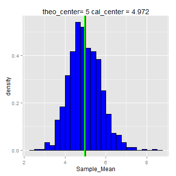
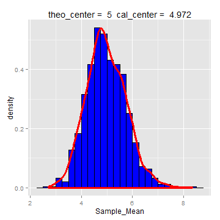

Version: V00

Date: 21-dec-2014

GitHub Repository: https://github.com/A6111E/datasciencecoursera/tree/master/Statistical_Inference/Assignment_Part1

#### Introduction:

**Exponential Distribution:** is the probability distribution that describes the time between events in a Poisson process, i.e. a process in which events occur continuously and independently at a constant average rate. 

The exponential distribution occurs naturally when describing the lengths of the inter-arrival times in a homogeneous Poisson process. Describes the time for a continuous process to change state.

In real scenarios, the assumption of a constant rate (or probability per unit time) is rarely satisfied. 

For example, the rate of incoming phone calls differs according to the time of day. But if we focus on a time interval during which the rate is roughly constant, such as from 2 to 4 p.m. during work days, the exponential distribution can be used as a good approximate model for the time until the next phone call arrives. 

Examples which yield approximately exponentially distributed variables:

- Time until a radioactive particle decays, or the time between clicks of a geiger counter. 

- Time it takes before your next telephone call

Exponential variables can also be used to model situations where certain events occur with a constant probability per unit length, such as the distance between mutations on a DNA strand, or between roadkills on a given road.

**Expected Value:** the mean or expected value of an exponentially distributed random variable $X$ with rate parameter $lambda$ is given by:

$E[X] = 1/lambda = beta$

**Variance:** $Var[X] = 1/lambda^2$

**Standard Deviation (is equal to the mean):** $sd[X] = 1/lambda = beta$

**Mean Standard Error:** $se[X] = sd/sqrt(1/n)$

**Sample Mean:** $Sample_Mean [X] = 1/sample.size(sum(xi))$

**t Confidence Interval:** $t Confidence Interval= E[X] +/- t(n-1) × sd/sqrt(n)$

*Partial Source:* http://en.wikipedia.org/wiki/Exponential_distribution

### Data Processing:


#### Data Set


#### Table: Summary Simulation Random Exponential Distribution 
##### Simulations = 1000 - Sample Size = 40 - lambda = 0.2

```r
colNames <- c("Trial_1", "Trial_100", "Trial_500", "Trial_750", "Trial_1000")
pr1 <- DT[ , colNames, with = FALSE]

xt <- xtable(summary(pr1))
print(xt, type = "html", floating = FALSE)
```

<!-- html table generated in R 3.1.2 by xtable 1.7-4 package -->
<!-- Sun Dec 21 14:31:03 2014 -->
<table border=1>
<tr> <th>  </th> <th>    Trial_1 </th> <th>   Trial_100 </th> <th>   Trial_500 </th> <th>   Trial_750 </th> <th>   Trial_1000 </th>  </tr>
  <tr> <td align="right"> 1 </td> <td> Min.   : 0   </td> <td> Min.   : 0   </td> <td> Min.   : 0.2   </td> <td> Min.   : 0.1   </td> <td> Min.   : 0.0   </td> </tr>
  <tr> <td align="right"> 2 </td> <td> 1st Qu.: 2   </td> <td> 1st Qu.: 2   </td> <td> 1st Qu.: 1.0   </td> <td> 1st Qu.: 0.4   </td> <td> 1st Qu.: 1.5   </td> </tr>
  <tr> <td align="right"> 3 </td> <td> Median : 4   </td> <td> Median : 3   </td> <td> Median : 2.3   </td> <td> Median : 1.7   </td> <td> Median : 3.7   </td> </tr>
  <tr> <td align="right"> 4 </td> <td> Mean   : 6   </td> <td> Mean   : 5   </td> <td> Mean   : 4.0   </td> <td> Mean   : 2.7   </td> <td> Mean   : 4.9   </td> </tr>
  <tr> <td align="right"> 5 </td> <td> 3rd Qu.: 6   </td> <td> 3rd Qu.: 6   </td> <td> 3rd Qu.: 5.5   </td> <td> 3rd Qu.: 3.3   </td> <td> 3rd Qu.: 7.2   </td> </tr>
  <tr> <td align="right"> 6 </td> <td> Max.   :32   </td> <td> Max.   :37   </td> <td> Max.   :16.9   </td> <td> Max.   :16.1   </td> <td> Max.   :21.0   </td> </tr>
   </table>

#### Table: Mean Value for each Simulation

```r
xt <- xtable(DT1[1:10, ], digits = 2)
print(xt, type = "html", include.rownames = FALSE, hline.after=c(1), floating = FALSE)
```

<!-- html table generated in R 3.1.2 by xtable 1.7-4 package -->
<!-- Sun Dec 21 14:31:03 2014 -->
<table border=1>
<tr> <th> Sample_Mean </th> <th> Trial </th>  </tr>
 <tr> <td align="right"> 5.55 </td> <td align="right">   1 </td> </tr>
   <tr> <td align="right"> 4.67 </td> <td align="right">   2 </td> </tr>
  <tr> <td align="right"> 4.26 </td> <td align="right">   3 </td> </tr>
  <tr> <td align="right"> 4.61 </td> <td align="right">   4 </td> </tr>
  <tr> <td align="right"> 5.30 </td> <td align="right">   5 </td> </tr>
  <tr> <td align="right"> 3.63 </td> <td align="right">   6 </td> </tr>
  <tr> <td align="right"> 6.23 </td> <td align="right">   7 </td> </tr>
  <tr> <td align="right"> 3.68 </td> <td align="right">   8 </td> </tr>
  <tr> <td align="right"> 4.84 </td> <td align="right">   9 </td> </tr>
  <tr> <td align="right"> 4.98 </td> <td align="right">  10 </td> </tr>
  </table>

#### Graphic: Random Exponential Distribution 

```r
theo_center <- mu               # distribution theoretical center
cal_center <- mean(p)           # distribution calculated center

p1 <- ggplot(DT1, aes(x = Sample_Mean))
        p1 <- p1 + geom_histogram(fill = "blue",
                                binwidth = 0.25, aes(y = ..density..), colour = "black")
        p1 <- p1 + geom_vline(xintercept = theo_center, size = 0.75, colour = "red")
        p1 <- p1 + geom_vline(xintercept = cal_center, size = 0.75, colour = "green")
        mse <- round(cal_center, 3)
        p1 <- p1 + labs(title = paste("theo_center=", theo_center, "cal_center =", mse))
        p1 <- p1 + labs(subtitle = paste("red", "green"))
grid.arrange(p1, ncol = 1)
```

 

Remarks:

- Red Vertical Line: distributiontheoritical center

- Green Vertical Line: distribution calculated center 

##### Q1 - Results:


The calculated center from 1000 simulations for $40$ exponential distributions with $lambda = 0.2$, is approximately $5$, which corresponds to theoretical center of distribution ($E[X] = 1/lambda = 5$). 

Increasing the simulations, the calculated gets closer to theoretical center.

**A. Theoretical Center:**              $5$

**B. Calculated Center:**               $4.97$

##### Q2 - Results:


The calculated variance from $1000$ simulations for $40$ exponential distributions samples  with $lambda = 0.2$ and theoretical variance $Var[X] = 1/lambda^2$ are:

**A. Theoretical Variance:**            $25$

**B. Calculated Variance:**             $24.57$

Increasing the simulations, the calculated gets near to theoretical variance, and the exponential distributions trend to be a standard normal distribution.

For example:

A. The calculated variance from $1$ simulation for $40$ exponential distributions random variables is $41.9$ (for this simulation).

B. The theoretical variance $Var[X] = 1/lambda^2$, is $25$  

Decreasing the simulations, the calculated variance gets far away to theoretical variance, and the exponential distributions trend NOT to be a standard normal distribution.

##### Q3 - Results:


#### Graphic: Random Exponential Distribution ~ Standard Normal Distribution 

```r
p3 <- ggplot(DT1, aes(x = Sample_Mean))
        p3 <- p3 + geom_histogram(fill = "blue",
                                binwidth = 0.25, aes(y = ..density..), colour = "black")
        p3 <- p3 + geom_density(size = 1.25, colour = "red")
        mse <- round(cal_center, 3)
        p3 <- p3 + labs(title = paste('theo_center = ', mu, ' cal_center = ', mse))
grid.arrange(p3, ncol = 1)
```

 

For a standard normal distribution, $68%$, $95%$ and $99%$ of the normal density, lies within $1$, $2$ and $3$ standard deviations from the mean, respectively

The calculted percentage from the sample means of the exponential distribution ($lambda = 0.2$) are:

**A. Percentage of Values between +/-1 Standard Deviation:**         $69.6% / 68%$

**B. Percentage of Values between +/-2 Standard Deviation:**         $95.4% / 95%$

**C. Percentage of Values between +/-3 Standard Deviation:**         $99.6% / 99%$

Both, the graphic "Random Exponential Distribution ~ Standard Normal Distribution", and the calculated percentage values, indicates that if the sample trend to be infinite, the random exponential distribution will convert to a standard normal distribution.

The confidence interval for the quantification of uncertainty in the exponential dsitribution is:

**A. Confidence Interval 95% - Up:**                       $5.01$            

**B. Confidence Interval 95% - Down:**                     $4.93$

### Session Information

```
## R version 3.1.2 (2014-10-31)
## Platform: x86_64-w64-mingw32/x64 (64-bit)
## 
## locale:
## [1] LC_COLLATE=Spanish_Colombia.1252  LC_CTYPE=Spanish_Colombia.1252   
## [3] LC_MONETARY=Spanish_Colombia.1252 LC_NUMERIC=C                     
## [5] LC_TIME=Spanish_Colombia.1252    
## 
## attached base packages:
## [1] grid      stats     graphics  grDevices utils     datasets  methods  
## [8] base     
## 
## other attached packages:
## [1] gridExtra_0.9.1  knitr_1.8        xtable_1.7-4     ggplot2_1.0.0   
## [5] data.table_1.9.4
## 
## loaded via a namespace (and not attached):
##  [1] chron_2.3-45     colorspace_1.2-4 digest_0.6.4     evaluate_0.5.5  
##  [5] formatR_1.0      gtable_0.1.2     htmltools_0.2.6  labeling_0.3    
##  [9] MASS_7.3-35      munsell_0.4.2    plyr_1.8.1       proto_0.3-10    
## [13] Rcpp_0.11.3      reshape2_1.4     rmarkdown_0.3.3  scales_0.2.4    
## [17] stringr_0.6.2    tools_3.1.2      yaml_2.1.13
```


