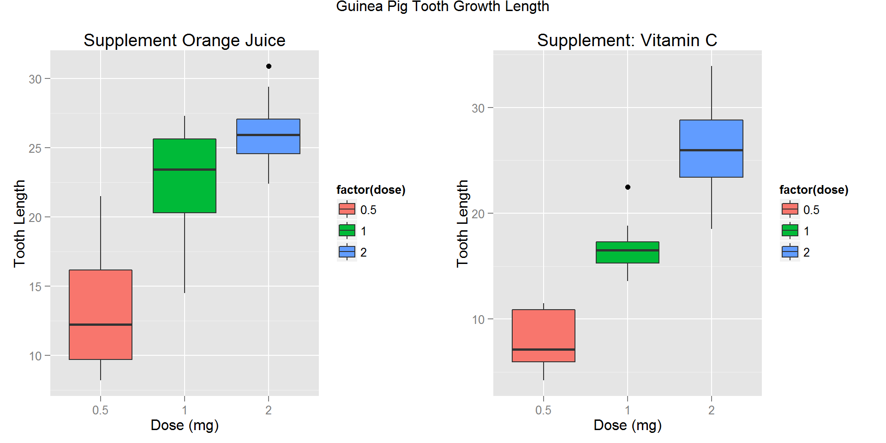
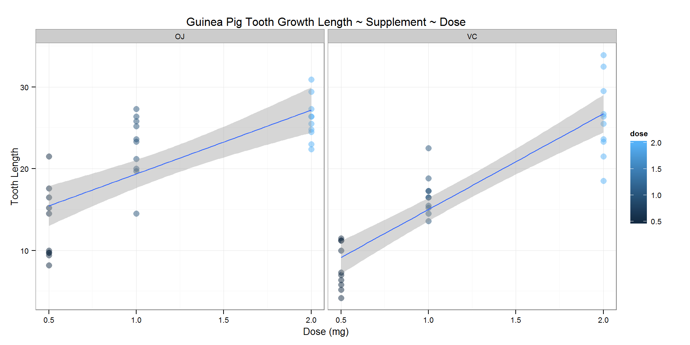

Version: V00

Date: 21-dec-2014

GitHub Repository: https://github.com/A6111E/datasciencecoursera/tree/master/Statistical_Inference/Assignment_Part2

Data Source: R Datasets Package (http://svitsrv25.epfl.ch/R-doc/library/datasets/html/00Index.html)

#### Synopsis:
During the 2nd World War, the Canadian Government was concern, because the difficulty of providing natural sources of $Vitamin C$ to the armed forces. In as much as chemical procedures gave different results, as to the potency of food in which the armed forces were interested, the Department of Nutrition of the McGill University in Quebec, was requested in 1942 to establish a Vitamin C bio-assay, which might be used as a check against chemical procedures (http://jn.nutrition.org/content/33/5/491.full.pdf)

**DataSet Description:** data with the response the tooth growth the length of odontoblasts (teeth) in each of $10$ guinea pigs at each of $3$ dose levels of Vitamin C ($0.5$, $1$, and $2$ mg), with each of two delivery methods ($OJ:orange juice$ or $VC: ascorbic acid$). 

**- Data Frame:** $60$ observations - $3$ variables

**- Variable [len]:** numeric - tooth length

**- Variable [supp]:** factor - supplement type (VC or OJ)

**- Variable [dose]:** numeric - dose in milligrams (mg) 

### Exploratory Analysis:


#### Table: Data Summary - Guinea Pig Tooth Growth per Supplement / Dose 
<!-- html table generated in R 3.1.2 by xtable 1.7-4 package -->
<!-- Sat Dec 27 14:41:11 2014 -->
<table border=1>
<tr> <th>  </th> <th> Supplement </th> <th> Dose </th> <th> Average </th> <th> Std_Deviation </th> <th> Variance </th> <th> Median </th> <th> Max </th> <th> Min </th>  </tr>
  <tr> <td align="right"> 1 </td> <td> OJ </td> <td align="right"> 0.50 </td> <td align="right"> 13.23 </td> <td align="right"> 4.46 </td> <td align="right"> 19.89 </td> <td align="right"> 12.25 </td> <td align="right"> 21.50 </td> <td align="right"> 8.20 </td> </tr>
  <tr> <td align="right"> 2 </td> <td> OJ </td> <td align="right"> 1.00 </td> <td align="right"> 22.70 </td> <td align="right"> 3.91 </td> <td align="right"> 15.30 </td> <td align="right"> 23.45 </td> <td align="right"> 27.30 </td> <td align="right"> 14.50 </td> </tr>
  <tr> <td align="right"> 3 </td> <td> OJ </td> <td align="right"> 2.00 </td> <td align="right"> 26.06 </td> <td align="right"> 2.66 </td> <td align="right"> 7.05 </td> <td align="right"> 25.95 </td> <td align="right"> 30.90 </td> <td align="right"> 22.40 </td> </tr>
  <tr> <td align="right"> 4 </td> <td> VC </td> <td align="right"> 0.50 </td> <td align="right"> 7.98 </td> <td align="right"> 2.75 </td> <td align="right"> 7.54 </td> <td align="right"> 7.15 </td> <td align="right"> 11.50 </td> <td align="right"> 4.20 </td> </tr>
  <tr> <td align="right"> 5 </td> <td> VC </td> <td align="right"> 1.00 </td> <td align="right"> 16.77 </td> <td align="right"> 2.52 </td> <td align="right"> 6.33 </td> <td align="right"> 16.50 </td> <td align="right"> 22.50 </td> <td align="right"> 13.60 </td> </tr>
  <tr> <td align="right"> 6 </td> <td> VC </td> <td align="right"> 2.00 </td> <td align="right"> 26.14 </td> <td align="right"> 4.80 </td> <td align="right"> 23.02 </td> <td align="right"> 25.95 </td> <td align="right"> 33.90 </td> <td align="right"> 18.50 </td> </tr>
   </table>

Remarks:

- Supplement: OJ (Orange Juice) - VC (Vitamin C - ascorbic acid)

- Average / Std_Deviation / Variance: statistic data for the tooth growth length 

- GitHub Repository: /reports

#### Table: Data Summary - Supplement Orange Juice 
<!-- html table generated in R 3.1.2 by xtable 1.7-4 package -->
<!-- Sat Dec 27 14:41:11 2014 -->
<table border=1>
<tr> <th>  </th> <th> OJ_dos0.5 </th> <th> OJ_dos1.0 </th> <th> OJ_dos2.0 </th>  </tr>
  <tr> <td align="right"> 1 </td> <td> 15.2 </td> <td> 20 </td> <td> 26 </td> </tr>
  <tr> <td align="right"> 2 </td> <td> 21.5 </td> <td> 23 </td> <td> 26 </td> </tr>
  <tr> <td align="right"> 3 </td> <td> 17.6 </td> <td> 24 </td> <td> 22 </td> </tr>
  <tr> <td align="right"> 4 </td> <td>  9.7 </td> <td> 26 </td> <td> 24 </td> </tr>
  <tr> <td align="right"> 5 </td> <td> 14.5 </td> <td> 20 </td> <td> 25 </td> </tr>
  <tr> <td align="right"> 6 </td> <td> 10.0 </td> <td> 25 </td> <td> 31 </td> </tr>
  <tr> <td align="right"> 7 </td> <td>  8.2 </td> <td> 26 </td> <td> 26 </td> </tr>
  <tr> <td align="right"> 8 </td> <td>  9.4 </td> <td> 21 </td> <td> 27 </td> </tr>
  <tr> <td align="right"> 9 </td> <td> 16.5 </td> <td> 14 </td> <td> 29 </td> </tr>
  <tr> <td align="right"> 10 </td> <td>  9.7 </td> <td> 27 </td> <td> 23 </td> </tr>
   </table>

#### Table: Data Summary - Supplement Vitamin C
<!-- html table generated in R 3.1.2 by xtable 1.7-4 package -->
<!-- Sat Dec 27 14:41:11 2014 -->
<table border=1>
<tr> <th>  </th> <th> VC_dos0.5 </th> <th> VC_dos1.0 </th> <th> VC_dos2.0 </th>  </tr>
  <tr> <td align="right"> 1 </td> <td>  4.2 </td> <td> 16 </td> <td> 24 </td> </tr>
  <tr> <td align="right"> 2 </td> <td> 11.5 </td> <td> 16 </td> <td> 18 </td> </tr>
  <tr> <td align="right"> 3 </td> <td>  7.3 </td> <td> 15 </td> <td> 34 </td> </tr>
  <tr> <td align="right"> 4 </td> <td>  5.8 </td> <td> 17 </td> <td> 26 </td> </tr>
  <tr> <td align="right"> 5 </td> <td>  6.4 </td> <td> 22 </td> <td> 26 </td> </tr>
  <tr> <td align="right"> 6 </td> <td> 10.0 </td> <td> 17 </td> <td> 32 </td> </tr>
  <tr> <td align="right"> 7 </td> <td> 11.2 </td> <td> 14 </td> <td> 27 </td> </tr>
  <tr> <td align="right"> 8 </td> <td> 11.2 </td> <td> 14 </td> <td> 22 </td> </tr>
  <tr> <td align="right"> 9 </td> <td>  5.2 </td> <td> 19 </td> <td> 23 </td> </tr>
  <tr> <td align="right"> 10 </td> <td>  7.0 </td> <td> 16 </td> <td> 30 </td> </tr>
   </table>

#### Graphic: Guinea Pig Tooth Growth Length ~ Supplement ~ Dose 
  

Remarks:

- OJ: supplement Orange Juice

- VC: supplement Vitamin C

### Basic Summary
The summary table "Data Summary - Guinea Pig Tooth Growth per Supplement / Dose" included above, shows statistical data like the mean, standard deviation, variance, median, maximal and minimal values, for each type of supplement and dose.

- For both supplement groups, Orange Juice and Vitamin C, as the doses increases, the tooth growth increases.
- For doses of $0.5$ and $1.0 mg$, the maximal value of tooth growth corresponds to the supplement **Orange Juice**.
- For doses of $2.0 mg$, the maximal value of tooth growth corresponds to the supplement  **Vitamin C**.
- For doses of $0.5$ and $1.0 mg$, the mean of tooth growth for Orange Juice is higher than for **Vitamin C**.
- For doses of $2.0 mg$, there is no difference in the mean of tooth growth for both **supplements**.

**Initial Conclusions:**

- **Orange Juice** could have more impact on tooth growth for $0.5$ and $1.0 mg$ doses, with maximal values of $21.50$ and $27.30$, although the variance is widely spread, standard deviation is higher than for Vitamin C.

- **Vitamin C** could have more impact on tooth growth for $2.0 mg$ doses, with maximal values of $33.90$, although the variance is widely spread. 

- There is **not evidence** of a dependence of tooth growth with the supplement, Orange Juice or Vitamin C.

- In both cases, there is **clear evidence** of a dependence of tooth growth on dose.

### Analysis - Gosset's t Test:

**Hypothesis**:

- Null hypothesis ($H_0$): is that the mean tooth growth for $Orange Juice$ (OJ) is equal to the mean tooth growth for $Vitamin C$ (VC), for the same dose. 

- Alternative Hypothesis ($H_a$): not equal.

$$H_0: \mu_{VC} = \mu_{OJ}$$
$$H_a: \mu_{VC} \ne \mu_{OJ}$$

**Assumptions**:

- The test was done on $10$ pigs chosen randomly, for each supplement ($Orange Juice - Vitamin C$) and each dose ($0.5, 1, 2 mg$).

- Independent Groups: (not paired).

- Unequal variance.

For the **Gosset's t Test**, the dataset have the following groups:

- Group 1: Dose: $0.5mg$ ~ both Supplements

- Group 2: Dose: $1.0mg$ ~ both Supplements

- Group 3: Dose: $2.0mg$ ~ both Supplements

**Total t test Groups:** $3$

#### Confidence Interval Analysis 

```r
# t Test Outputs
# t: $statistic / df: $parameter / p: $p.value / Confidence Interval: $conf
# Mean of Differences: $estimate
# Alternative: $alternative / Method:  $method / Data Name: $data.name

sta_data <- matrix(data = NA, nrow = 0, ncol = 8)

# Group 1 - Per Dose: 0.5 mg ~ both Supplements
group05_OJ_VC <- ToothGrowth[ToothGrowth$dose == "0.5",]

groupOJ <- group05_OJ_VC[group05_OJ_VC$supp == "OJ"]
groupOJ[ , c("supp", "dose") := NULL]
groupOJ <- groupOJ$len

groupVC <- group05_OJ_VC[group05_OJ_VC$supp == "VC"]
groupVC[ , c("supp", "dose") := NULL]
groupVC <- groupVC$len

diff <- groupOJ - groupVC

# t Confidence
# Calculation - Option 1 
mn <- mean(diff)
s <- sd(diff)
n <- length(groupOJ)

t.test1 <- mn + c(-1, 1) * qt(.95, n-1) * s / sqrt(n)

t.true <- t.test(groupOJ, groupVC, paired = TRUE, var.equal = TRUE, conf.level = 0.95)

t.false <- t.test(groupOJ, groupVC, paired = TRUE, var.equal = FALSE, conf.level = 0.95)

sta_data <- rbind(c(t.true$data.name, round(t.true$statistic, 5), 
                   round(t.true$parameter, 5), round(t.true$estimate, 5), 
                   round(t.true$p.value, 5) , round(t.true$conf, 5), "TRUE"))

sta_data <- rbind(sta_data, c(t.true$data.name, round(t.true$statistic, 5), 
                   round(t.true$parameter, 5), round(t.true$estimate, 5), 
                   round(t.true$p.value, 5) , round(t.true$conf, 5), "FALSE"))
```


#### Table: Statistical Data Summary - Gosset's t Test 
<!-- html table generated in R 3.1.2 by xtable 1.7-4 package -->
<!-- Sat Dec 27 14:41:16 2014 -->
<table border=1>
<tr> <th>  </th> <th> Data </th> <th> t_Quantile </th> <th> Degrees_Freedom_df </th> <th> Mean Difference </th> <th> p_value </th> <th> Confidence_ Interval_- </th> <th> Confidence_Interval_+ </th> <th> Equal_Variances </th>  </tr>
  <tr> <td align="right"> 1 </td> <td> groupOJ and groupVC </td> <td> 2.9791 </td> <td> 9 </td> <td> 5.25 </td> <td> 0.01547 </td> <td> 1.26346 </td> <td> 9.23654 </td> <td> FALSE </td> </tr>
  <tr> <td align="right"> 2 </td> <td> groupOJ and groupVC </td> <td> 3.37212 </td> <td> 9 </td> <td> 5.93 </td> <td> 0.00823 </td> <td> 1.95191 </td> <td> 9.90809 </td> <td> FALSE </td> </tr>
  <tr> <td align="right"> 3 </td> <td> groupOJ and groupVC </td> <td> -0.04259 </td> <td> 9 </td> <td> -0.08 </td> <td> 0.96696 </td> <td> -4.32898 </td> <td> 4.16898 </td> <td> FALSE </td> </tr>
   </table>

Remarks: 
- t-test Statistical Summaries on GitHub Repository: /reports

### Conclusions:

**(1) Orange Juice and Vitamin C effectiveness - Dose 0.5 mg:**
- Confidence Interval:          $95%$

- Mean Difference:              $5.25$

- p-value: $0.01547$ **<** $0.05$

- Null hypothesis: *would be rejected* (mean difference is not $0$)

- The supplement *Orange Juice is more effective for this dose*.

**(2) Orange Juice and Vitamin C effectiveness - Dose 1 mg:**
- Confidence Interval:          $95%$

- Mean Difference:              $5.93$

- p-value: $0.00823$ **<** $0.05$

- Null hypothesis: *would be rejected* (mean difference is not $0$)

- The supplement *Orange Juice is more effective for this dose*.

**(3) Orange Juice and Vitamin C effectiveness - Dose 2 mg:**
- Confidence Interval:          $95%$

- Mean Difference:              $-0.08$

- p-value: $0.96696$ **>** $0.05$

- Null hypothesis: *could not be rejected* (mean difference is almost $0$)

- It 's not possible to conclude which supplement *Orange Juice* or *Vitamin C* is more effective for this dose.

**(4) Supplement / Doses:** Higher doses, the more effective it is on the teeth growth without influence on the supplement.

### Session Information

```
## R version 3.1.2 (2014-10-31)
## Platform: x86_64-w64-mingw32/x64 (64-bit)
## 
## locale:
## [1] LC_COLLATE=Spanish_Colombia.1252  LC_CTYPE=Spanish_Colombia.1252   
## [3] LC_MONETARY=Spanish_Colombia.1252 LC_NUMERIC=C                     
## [5] LC_TIME=Spanish_Colombia.1252    
## 
## attached base packages:
## [1] grid      stats     graphics  grDevices utils     datasets  methods  
## [8] base     
## 
## other attached packages:
## [1] plyr_1.8.1       gridExtra_0.9.1  xtable_1.7-4     ggplot2_1.0.0   
## [5] data.table_1.9.4 knitr_1.8       
## 
## loaded via a namespace (and not attached):
##  [1] chron_2.3-45     codetools_0.2-9  colorspace_1.2-4 digest_0.6.4    
##  [5] evaluate_0.5.5   formatR_1.0      gtable_0.1.2     htmltools_0.2.6 
##  [9] labeling_0.3     MASS_7.3-35      munsell_0.4.2    proto_0.3-10    
## [13] Rcpp_0.11.3      reshape2_1.4     rmarkdown_0.3.3  scales_0.2.4    
## [17] stringr_0.6.2    tools_3.1.2      yaml_2.1.13
```


